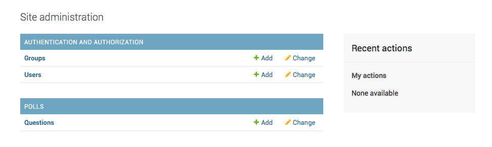

## チュートリアル 1 : プロジェクト作成とurl & viewによるページ表示
---

### プロジェクトの作成


```bash
$ django-admin startproject mysite
# 以下のディレクトリが作成される。
mysite/
    manage.py
    mysite/
        __init__.py
        settings.py
        urls.py
        wsgi.py
```

- manage.py: Django プロジェクトに対する様々な操作を行うためのコマンドラインユーティリティです｡詳しくは django-admin と manage.py 内の manage.py を参照してください｡
内側の mysite/ ディレクトリは、このプロジェクトの実際の Python パッケージです。この名前が Python パッケージの名前であり、 import の際に 使用する名前です (例えば import mysite.urls) 。
- mysite/__init__.py: このディレクトリが Python パッケージであることを Python に知らせるための空のファイルです。Python の初心者は、 Python の公式 ドキュメントの more about packages を読んで下さい。
- mysite/settings.py: Django プロジェクトの設定ファイルです。 設定の仕組みは Djangoの設定 を参照してください。
- mysite/urls.py: Django プロジェクトの URL 宣言、いうなれば Django サイトにおける「目次」に相当します。詳しくは URL ディスパッチャ を参照 してください。
- mysite/wsgi.py: プロジェクトをサーブするためのWSGI互換Webサーバーとのエントリーポイントです。詳細は WSGI とともにデプロイするには を参照してください。

基本的に`python manage.py ~`とすることで様々なコマンドラインを実行できる。

### アプリケーションの作成
Pollsというアプリケーションの作成を目標とする。ディレクトリ構成は変える必要はないらしく、コードを書く事に集中できる。

```bash
$ python manage.py startapp polls
# 以下のように、pollsというディレクトリが作成される。
mysite/
├── manage.py
├── mysite
└── polls
    ├── __init__.py
    ├── admin.py
    ├── apps.py
    ├── migrations
    │   └── __init__.py
    ├── models.py
    ├── tests.py
    └── views.py
```


### view作成
- viewとは
viewはrequestを受け取って、それに対応したレスポンス画面を見せてくれる存在？？(後で調べる)

- viewの作成方法
views.pyに全て書く。
```py
# polls/views.py¶
from django.http import HttpResponse

def index(request):
    return HttpResponse("Hello, world. You're at the polls index.")

```

- viewのurlとの対応づけ
まずapp内(polls dir内)に新しく`urls.py`を作成し、urlと対応するview関数を定義。

```py
# polls/urls.py
from django.urls import path
from . import views

urlpatterns = [
    path('', views.index, name='index'),
]
```

その後、mysiteの`urls.py`にpolls.urlsを反映させる事で、viewを見れるようにする。
URLパターンをインクルードするときはいつでも include() を使うべきです。 admin.site.urls はこれについての唯一の例外です。

```py
# mysite/urls.py¶
from django.contrib import admin
from django.urls import include, path

urlpatterns = [
    path('polls/', include('polls.urls')),
    path('admin/', admin.site.urls),
]
```

- django.urls.include
pollsは独自のpolls.urlsを持っているので、それに対応づけすることが可能になる。
- django.urls.path  
pathの引数に関しての説明
  - route
  urlのパラーんを含む文字列。Djangoのページアクセスはurlpatterns のはじめのパターンから開始し、リストを順に下に見ていく。
  - view
  リクエストされたurlとマッチする正規表現を見つけると、指令されたview関数を呼び出す。view関数は基本的に`views.py`で定義されている。
  - kwargs
  任意のキーワード引数を辞書としてview関数に渡せる。
  - name
  URLに名前をつけれる。

## チュートリアル２：Modelとデータベースの作成
--- 

### データベースの設定
`mysite/mysettings.py`にて定義。
- DATABASES
データベースの設定はDATABASES の 'default' 項目内で行う。
  - ENGINE
'django.db.backends.sqlite3'、 'django.db.backends.postgresql'、 'django.db.backends.mysql' または 'django.db.backends.oracle' のいずれかにする。[そのほかのバックエンド](https://docs.djangoproject.com/ja/2.1/ref/databases/#third-party-notes)も使用可能。
  - NAME
データベースの名前。SQLiteを使用している場合、データベースはコンピュータ上のファイルになります。その場合、NAME には、そのファイルのファイル名を含んだ絶対パスを指定する必要があります。デフォルト値は os.path.join(BASE_DIR, 'db.sqlite3')。

  > SQLite 以外のデータベースの場合
  > もし SQLite 以外を使っている場合、 databaseを今のうちに作っておいてください。 "CREATE DATABASE database_name;" とデータベースのインタラクティブプロンプトで実行してください。
  >mysite/settings.pyのデータベースユーザに「データベース作成」の権限があることを確認します。これは、この後のチュートリアルの テストDB を自動作成することができます。

  SQLite を使っている場合は、前もってすることはありません。必要であればデータベースファイルが自動で生成されます。

 - INSTALLED_APPS
Djangoインスタンスで有効化されている全てのアプリの名前を保持している。以下のアプリがデフォルトで使用されている。
    - django.contrib.admin - 管理（admin）サイト。まもなく使います
    - django.contrib.auth - 認証システム
    - django.contrib.contenttypes - コンテンツタイプフレームワーク
    - django.contrib.sessions - セッションフレームワーク
    - django.contrib.messages - メッセージフレームワーク
- django.contrib.staticfiles - 静的ファイルの管理フレームワーク

以下のコマンドにより、データベースのテーブル作成。
```bash
$ python manage.py migrate
```


### モデルの作成
polls/models.pyで定義する。

```py
from django.db import models

class Question(models.Model):
    question_text = models.CharField(max_length=200)
    pub_date = models.DateTimeField('date published')


class Choice(models.Model):
    question = models.ForeignKey(Question, on_delete=models.CASCADE)
    choice_text = models.CharField(max_length=200)
    votes = models.IntegerField(default=0)
```
- テーブルの定義
class <Table Name>(models.Model)によりテーブルを定義する。
- カラムの定義
各テーブルのカラムを変数にて定義する。様々なFieldクラス(CharField, IntegerField)を持っており、そのインスタンスを設定すること、カラムを定義できる。
- 関係の定義
ForeignKeyを使用して、テーブルの関係を定義できる。上記ではChoiceが一つのQuestionに関連づけられていると定義している。Djangoでは「多対一、多対多、一対一」全てサポートしている。

### モデルの有効化
アプリケーションを有効化するために、プロジェクトにその定義を書く。
```py
# mysite/setting.py
INSTALLED_APPS = [
    'django.contrib.admin',
    'django.contrib.auth',
    'django.contrib.contenttypes',
    'django.contrib.sessions',
    'django.contrib.messages',
    'django.contrib.staticfiles',
    # polls/app.pyに記載されているClassを追加する事で
    # Polls Appの有効化が行える。
    'polls.apps.PollsConfig',
]
```
モデルの変更があったので、まずそれをDjangoに伝えるために新たなmigrate fileを作成する。
```sh
$ python manage.py makemigrations polls
# 以下が記載
Migrations for 'polls':
  polls/migrations/0001_initial.py:
    - Create model Choice
    - Create model Question
    - Add field question to choice
```
上記により`polls/migrations/0001_initial.py`というファイルが作成される。

以下のコードにより、どのようなコードが実行されるか見れる。
```sh
python manage.py sqlmigrate polls 0001
```

migrateを再度実行する。
```
$ python manage.py migrate
```
これにより、migrate fileがデータベースに反映される。

**モデルの作成・変更をまとめ**
- モデルを変更する (models.py の中の)
- これらの変更のためのマイグレーションを作成するために python manage.py makemigrations を実行します。
- データベースにこれらの変更を適用するために python manage.py migrate を実行する。
migrationの作成と適用が分割されている理由は、migrationをgitなどでバージョン管理できるようにするため。


### モデルに関するその他

- モデル作成におけるrecommendation
モデルのオブジェクトとしての表現をわかりやすくする為に、
`__str__(self)`をoverrideすることが推奨される。

```py
 # polls/models.py¶
from django.db import models

class Question(models.Model):
    # ...
    def __str__(self):
        return self.question_text

class Choice(models.Model):
    # ...
    def __str__(self):
        return self.choice_text
```

- 対話シェル実行
以下で対話シェルを実行できるので色々と実験できる。
```sh
$ python manage.py shell
```

```sh
>>> from polls.models import Choice, Question  # Import the model classes we just wrote.

# No questions are in the system yet.
>>> Question.objects.all()
<QuerySet []>

# Create a new Question.
# Support for time zones is enabled in the default settings file, so
# Django expects a datetime with tzinfo for pub_date. Use timezone.now()
# instead of datetime.datetime.now() and it will do the right thing.
>>> from django.utils import timezone
>>> q = Question(question_text="What is new?", pub_date=timezone.now())

# Save the object into the database. You have to call save() explicitly.
>>> q.save()

# Now it has an ID.
>>> q.id
1

# Access model field values via Python attributes.
>>> q.question_text
"What's new?"
>>> q.pub_date
datetime.datetime(2012, 2, 26, 13, 0, 0, 775217, tzinfo=<UTC>)

>>> q.question_text = "What is up?"
>>> q.save()

# objects.all() displays all the questions in the database.
>>> Question.objects.all()

# Django provides a rich database lookup API that's entirely driven by
# keyword arguments.
>>> Question.objects.filter(id=1)
<QuerySet [<Question: What is up?>]>
>>> Question.objects.filter(question_text__startswith='What')
<QuerySet [<Question: What is up?>]>

# Give the Question a couple of Choices. The create call constructs a new
# Choice object, does the INSERT statement, adds the choice to the set
# of available choices and returns the new Choice object. Django creates
# a set to hold the "other side" of a ForeignKey relation
# (e.g. a question's choice) which can be accessed via the API.
>>> q = Question.objects.get(pk=1)

# Display any choices from the related object set -- none so far.
>>> q.choice_set.all()
<QuerySet []>

# Create three choices.
>>> q.choice_set.create(choice_text='Not much', votes=0)
<Choice: Not much>
>>> q.choice_set.create(choice_text='The sky', votes=0)
<Choice: The sky>
>>> c = q.choice_set.create(choice_text='Just hacking again', votes=0)

# Choice objects have API access to their related Question objects.
>>> c.question
<Question: What is up?>

# And vice versa: Question objects get access to Choice objects.
>>> q.choice_set.all()
<QuerySet [<Choice: Not much>, <Choice: The sky>, <Choice: Just hacking again>]>
>>> q.choice_set.count()
3

```

> django extensionを入れて
shell_plus --notebookを使えるようにするとより良い。


## Django Adminについて(管理画面の自動生成)
コンテンツの追加・変更・削除するための管理画面生成は退屈な仕事である。
Djangoではモデルのための管理インターフェース群のadminを完全に自動化生成できる!!

- superuserの作成
```sh
$ python manage.py createsuperuser
# username, email, passwordの設定
Username: admin
Email address: admin@example.com
Password: **********
Password (again): *********
Superuser created successfully.
```
http://127.0.0.1:8000/admin/(開発環境じゃなければ変わる) にアクセスする。 

上記画像のように、何の処理も記述していない場合は
polls appが登録されない為、管理画面で扱いたいmodelをadmin.pyに記述する。
```py
# polls/admin.py
from django.contrib import admin

from .models import Question

# Questionモデルをadmin画面に登録。
admin.site.register(Question)
```


## チュートリアル３：viewの応用

### オーバービュー
viewは、リクエストされたurl(のドメイン以降)から決定される。
ここでは`URLconf`によるURL情報をviewに渡す方法を見ていく。

### 複数のview
以下のようにviewを追加する。
```py
# polls/views.py
def detail(request, question_id):
    return HttpResponse("You're looking at question %s." % question_id)

def results(request, question_id):
    response = "You're looking at the results of question %s."
    return HttpResponse(response % question_id)

def vote(request, question_id):
    return HttpResponse("You're voting on question %s." % question_id)
```

設定したviewのurlを設定する。
```py
# polls/urls.py¶
from django.urls import path

from . import views

urlpatterns = [
    # ex: /polls/
    path('', views.index, name='index'),
    # ex: /polls/5/
    path('<int:question_id>/', views.detail, name='detail'),
    # ex: /polls/5/results/
    path('<int:question_id>/results/', views.results, name='results'),
    # ex: /polls/5/vote/
    path('<int:question_id>/vote/', views.vote, name='vote'),
]
```
<型名:変数名>のようにすることで、urlの値をviewに渡すことが可能になる。


### テンプレートの使用
viewの役割は２つ
- リクエストされたページのコンテンツを含む HttpResponse オブジェクトを返す
-  Http404 のような例外の送出
上記２つを行えば、viewなどのような処理を行ってもいい。

templateはpolls dirの中に、 templates dirを作成する。その後、pollsというsub dirを作成する。
つまり、`polls/templates/polls/`に置く。
>[templates dirにpolls subdirを作る理由]
>settings.pyのTEMPLATESのAPP_DIRS=Trueになってる場合、各appのtemplates dirを探索する。その為、複数のappが存在する && 各sub dirを作成せずtemplates dirしか作成しない場合、templates内の同じファイルが競合(?)してしまう。(多分仕様的な問題。)だから、pollsというsub dirを作成することでapp毎のtemplateを参照できるようになる。

```html
<!--polls/templates/polls/index.html-->

    <ul>
    
        <li><a href="/polls/{{ question.id }}/">{{ question.question_text }}</a></li>
    
    </ul>

    <p>No polls are available.</p>

```

templateを使用するコードは以下。
```py
# polls/views.py
from django.http import HttpResponse
from django.template import loader

from .models import Question

def index(request):
    latest_question_list = Question.objects.order_by('-pub_date')[:5]
    # 以下の'polls/index.html'のpollsは作成したsub dirを示している。
    # つまりget_templateはtemplatesをhead dirにしている。
    template = loader.get_template('polls/index.html')
    context = {
        'latest_question_list': latest_question_list,
    }
    return HttpResponse(template.render(context, request))
```
また短縮して書くための`short cuts`も存在する。
HttpResponseとloaderをimportする手間が省ける。
```py
# polls/views.py
from django.shortcuts import render
from .models import Question

def index(request):
    latest_question_list = Question.objects.order_by('-pub_date')[:5]
    context = {'latest_question_list': latest_question_list}
    # render(request, <template_path>, <context for template>)
    return render(request, 'polls/index.html', context)
```

### 404エラー

```py
# polls/views.py
from django.shortcuts import get_object_or_404, render

from .models import Question
# ...
def detail(request, question_id):
    question = get_object_or_404(Question, pk=question_id)
    return render(request, 'polls/detail.html', {'question': question})
```

### テンプレートのURL処理
テンプレート内でリンクなどによるURLを扱う際に、
下記の様な機銃はコード編集が面倒となる。
```html
<!--polls/templates/polls/index.html-->
<li><a href="/polls/{{ question.id }}/">{{ question.question_text }}</a></li>
```
よって、以下のように変更するのがベスト。
```html
<!--polls/templates/polls/index.html-->
<li><a href="">{{ question.question_text }}</a></li>
```

detail viewのurlを`polls\12`から`polls\specific\12`などに変更したい時、
templatesを変更せずに、以下のようにurls.pyを変更するだけで良い。
```py
# polls/urls.py

# ...
# ここでname='detail'を参照している。
# the 'name' value as called by the  template tag
path('<int:question_id>/', views.detail, name='detail'),
# ...
```

```py
# polls/urls.py

# ...
# added the word 'specifics'
path('specifics/<int:question_id>/', views.detail, name="detail"),
# ...

```

また、現在はappがpollsのみだが複数ある場合は、
templateはどのurls.pyのnameを参照するべきか判断できない。
そのため、以下のように`app_name='polls'`を記述する。
```py
# polls/urls.py
from django.urls import path
from . import views

app_name = 'polls'
urlpatterns = [
    path('', views.index, name='index'),
    path('<int:question_id>/', views.detail, name='detail'),
    path('<int:question_id>/results/', views.results, name='results'),
    path('<int:question_id>/vote/', views.vote, name='vote'),
]
```

```html
<!--polls/templates/polls/index.html¶-->
<!--変更前-->
<li><a href="">{{ question.question_text }}</a></li>
```
```html
<!--polls/templates/polls/index.html¶-->
<!--変更後-->
<li><a href="">{{ question.question_text }}</a></li>
```

## チュートリアル４:POSTの使い方

よくある埋め込みhtml。
```html
<h1>{{ question.question_text }}</h1>

<p><strong>{{ error_message }}</strong></p>

<form action="" method="post">


    <input type="radio" name="choice" id="choice{{ forloop.counter }}" value="{{ choice.id }}">
    <label for="choice{{ forloop.counter }}">{{ choice.choice_text }}</label><br>

<input type="submit" value="Vote">
</form>
```

- formタグ : POST(orGET?)によるフォーム
  - action : URIの指定。
  - method : "get","post"の指定。
- inputタグ : 入力フィールドや送信ボタンなどを表示する
  - type : text, radio, submitなどいろんな形がある
    - submit : 送信ボタン。最近はinput より buttonタグの方がいいとか？？
    `<button type="submit"> Vote </button>`
  - name : formの値にアクセスするための名前空間。
  - value : 初期値？見せる値？
  - id : labelタグで結びつけれる。
- labelタグ : 実際に出力されるが,以下の手法で簡単に指定したいinputを選択しやすくする。
  - for : 結びつけたいinputタグのidを指定する。
- `{}` : crfという脆弱性を保護するために、djangoではformタグ内で必要となる。


```py
# polls/view.py
def vote(request, question_id):
    question = get_object_or_404(Question, pk=question_id)
    try:
        selected_choice = question.choice_set.get(pk=request.POST['choice'])
    except (KeyError, Choice.DoesNotExist):
        # Redisplay the question voting form.
        return render(request, 'polls/detail.html', {
            'question': question,
            'error_message': "You didn't select a choice.",
        })
    else:
        selected_choice.votes += 1
        selected_choice.save()
        # Always return an HttpResponseRedirect after successfully dealing
        # with POST data. This prevents data from being posted twice if a
        # user hits the Back button.
        return HttpResponseRedirect(reverse('polls:results', args=(question.id,)))
```

request.POSTでlike 辞書のようなオブジェクト。htmlのinputのnameタグとkeyが一致。
keyを指定することでPOST内の値は全てstring型。


### Topic:Formクラス
```py
# forms.py
from django import forms

class NameForm(forms.Form):
  your_name = forms.CharField(label='Your name', max_length=100)
```
展開されると以下のようになる。
```html
<label for="your_name">Your name: </label>
<input id="your_name" type="text" name="your_name" maxlength="100" required>
```

```py
# view.py

from .forms import NameForm

def get_name(request):
  # if this is a POST request we need to process the form data
  if request.method == 'POST':
      # create a form instance and populate it with data from the request:
      form = NameForm(request.POST)
      # check whether it's valid:
      if form.is_valid():
          # process the data in form.cleaned_data as required
          # ...
          # redirect to a new URL:
          return HttpResponseRedirect('/thanks/')

  # if a GET (or any other method) we'll create a blank form
  else:
      form = NameForm()

  return render(request, 'name.html', {'form': form})

```

name.htmlは以下のような簡単な記載で大丈夫。
```html
<!--name.html-->
<form action="/your-name/" method="post">
  
  {{ form }}
  <input type="submit" value="Submit">
</form>
```


```py:test.py
  print("hello")
```

