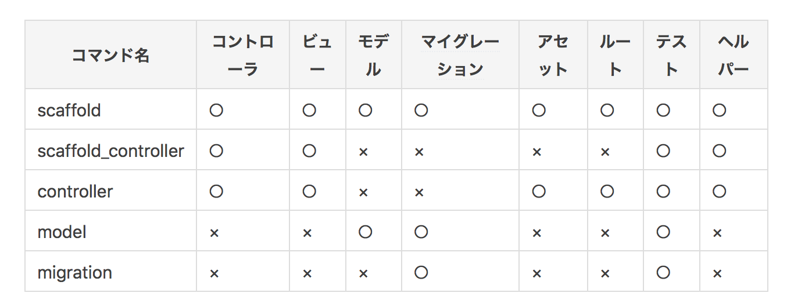

# Rails基本

## Rail appの作成
---
```bash
rails new [APP]
```
APP以下に下記のようなdir構成が出来上がる。
```bash
.
├── app
│   ├── assets
│   ├── channels
│   ├── controllers
│   ├── helpers
│   ├── jobs
│   ├── mailers
│   ├── models
│   └── views
├── bin
├── config
├── db
├── lib
├── log
├── public
├── storage
├── test
├── tmp
├── vendor
├── config.ru
├── Gemfile
├── Gemfile.lock
├── package.json
├── README.md
└── Rakefile

# ついでに.gitignoreと.ruby_verionもできてる。
```
主要dirの説明。

- app
  - assets
  staticみたいな感じ？cssやcscc, jsやcoffee,imageなどに高速にアクセスする。
  `http://RailsアプリのURL/assets/ファイル名`でアクセス可能。以下は例示。
  - controllers
  コントローラの作成。
  - helpers
  ヘルパー。hrb内で使いやすいコードを記述？
  - jobs 
  ????
  - mailers
  メール系？？
  - models
  モデルに関してのファイル
  - views
  viewに関してのファイル。hrb系のファイルが存在。
- config
  routes.rbなど存在する。
- db
  - sqlite3
  作成されたデータベース
  - seeds.rb
  最初に実行される。(?)データベースに擬似データの登録などが可能。
- public
  404fileなど。モデル等に依存しないstaticファイル？
- test
  テストコードが存在。
  
## rails generate
---
rails generateは非常に重要なコマンド(でもあり、こいつで秘匿化されすぎててわからん部分も多い。)

`rails g <command>`で実行可能。
以下が、command毎の実行対象。

`rails g controller`と `rails g model`にて、各実行対象(コントローラ・ビュー・モデル・マイグレーションetc8つの要素)が実行される場合にファイルがどこに作成されるかをみていく。
> (作成されるファイルは多少違うかも...?) scaffoldではmodelの指定しかせず、いくつかのindexやshowなどのviewを勝手に作成してくれそう。


User というコントローラとUser用のビュー(index, show)の作成。
```sh
rails g controller User index show
```

### rails g controller

- UserViewへのroute作成。
> routesの記述方法はちょっとややこしいので、後述する。
```rb
# config/routes.rb
  # 以下が追加。
  get 'users/index'
  get 'users/show
```

- aseets作成(ファイルのみ。)
```scss
// app/assets/stylesheets/users.scss
// Place all the styles related to the users controller here.
// They will automatically be included in application.css.
// You can use Sass (SCSS) here: http://sass-lang.com/
```
```coffee
## app/assets/javascripts/users.coffee
# Place all the behaviors and hooks related to the matching controller here.
# All this logic will automatically be available in application.js.
# You can use CoffeeScript in this file: http://coffeescript.org/
```

- helper作成(ファイルのみ)
```rb
# app/helpers/users_helper.rb
module UsersHelper
end
```

- controller作成
```rb
# app/controllers/users_controller.rb
class UsersController < ApplicationController

  def index
    # render "index"が省略されている。
    # app/views/users/index.html.erbのテンプレートをとってこれる。
  end
  
  # 何故かこれだけで、app/views/users/show.html.erbを引っ張ってこれる。
  # ????
  def show
  end
end

```
> 関数内に、何も記述しない場合


- view作成
```erb
<!--app/views/users/index.html.show-->
<h1>Users#index</h1>
<p>Find me in app/views/users/index.html.erb</p>

```

```erb
<!--app/views/users/show.html.show-->
<h1>Users#show</h1>
<p>Find me in app/views/users/show.html.show</p>
```

### rails g model と migrate

- model作成(何してんのか全くわからん。なんでこっちにフィールドの定義書かないねん、migrationfileだけでよくね？とおもってまう???)
ちなみにvalidationの設定とか、一対多の関係とかはここに書くっぽい。
```sh
rails g model user name:string username:string location:string about:text
```

```rb
# app/models/user.rb
class User < ApplicationRecord
end

```

- migrationファイルの作成
```rb
# db/migrate/20130630062417_create_users.rb
class CreateUsers < ActiveRecord::Migration
  def change
    create_table :users do |t|
      t.string :name
      t.string :username
      t.string :location
      t.text :about

      t.timestamps
    end
  end
end
```

### DB操作(rakeコマンド)
db作成
`rake db:create`
- migrationファイルのmigrate(データベースにmigrationファイルどうりのスキーマを登録)
`rake db:migrate`
- seedによる実データの登録
`rake db:seed`


## Routeの操作
---
### 特定のパスへのルーティング

- 通常のルーティング
[参考：RailsのRouteを読む](https://qiita.com/Yaruki00/items/d677e0751c90500afc8c)

`/about`というURLをStaticPageコントローラのaboutアクション(methos?)で処理する時の記述。
[get, post, patch,put,delete]のメソッドが使用可能。
```rb
# 例1 普通のやつ。
# <method> '<URL>', to: '<Controller>#<action>'
get   '/about', to: 'static_pages#about' 
get   '/about' => 'static_pages#about' # 例1-1:これもいける？

# 例2:コントローラとアクションを別にした例。
post  '/about', controller: 'static_pages', action: 'about'

# 例3: matchで複数メソッドを定義。viaでかく。
match '/about', to: 'static_pages#about', via: [:get, :post]

# 例4: matchで全てのメソッドを定義。あまり使わなそうっぽい。
match '/about', to: 'static_pages#about', via: :all 

# 例5: 名前をつけれる。
get   '/about', to: 'static_pages#about', as: 'aboutabout' # 例5
```
> 名前付きルートの活用はこのリンク{まだ読んでない}[Railsにおけるリンクの記述方法とそのテスト](https://qiita.com/kidach1/items/d704e7eb63513c3831ae)

- パラメータの付与
```rb
get   '/about/:id', to: 'static_pages#about' # 例1
get   '/about/*segment', to: 'static_pages#about' # 例2
get   '/about/*segment/:id', to: 'static_pages#about' # 例3
```
例1では`/about/1`や`/about/hoge`などにマッチします。params[:id]は1やhogeになります。
例2では`/about/hoge/fuga`や`/about/Fizz/Buzz/FizzBuzz`などにマッチします。params[:segment]はhoge/fugaやFizz/Buzz/FizzBuzzになります。
例3では、例えば`/about/a/b/c/1`にマッチし、params[:segment]はa/b/c、params[:id]は1になります。

- apiとしての使用
```rb
get   '/about', to: 'static_pages#about', defaults: {format: :json}
```
/aboutにアクセスした時に、/about.jsonにアクセスしたことにしてくれます。

### rootへのマッピング
```rb
root  'static_pages#home'
```
`/`へのルーティング。

### Resources(複数)へのマッチング
```rb
resources :users

# 以下と同じ
get    '/users',          to: 'users#index'   # ユーザ一覧ページ
get    '/users/:id',      to: 'users#show'    # 特定のユーザページ
get    '/users/new',      to: 'users#new'     # ユーザ登録ページ
post   '/users',          to: 'users#create'  # ユーザ作成
get    '/users/:id/edit', to: 'users#edit'    # 特定のユーザ編集ページ
patch  '/users/:id',      to: 'users#update'  # 特定のユーザ更新
delete '/users/:id',      to: 'users#destroy' # 特定のユーザ削除

# 制限したい時
resources :users, only: [:index, :show] # 書いたものだけ。matchとの擬態あまりわからん。
resources :devices, except: [:destroy] # 書いたものを除く
```

## グループ化
---
