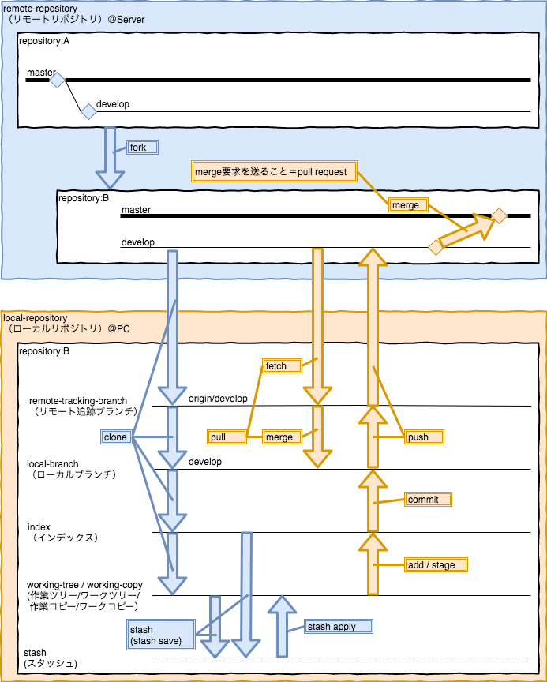

## 用語集
---
  - HEAD
  自分がいるコミットを示す。
  - repository
  commitを管理する場所。リモートとローカルがある。
    - remote repository
    GitHubやGitTabなどのクラウド上で管理されるリポジトリ。だいたいoriginと名付けられる。
    - local repository
    各PC内にあるリポジトリ。
  - working-tree
  実際の作業ファイル群。
  - index
  addした際にファイルが登録される場所。作業台のイメージ。working-treeをlocal repositoryに登録する際の中間的な役目をしている。
  - local_branch
  localにあるbranch。基本的に各コミットの最新部分を指す。
  - remote tracking branch
  remote repositoryのcommit状況を追跡するbranch。`origin/master`とか見える。
    > deleteなどによって、WORKDIRにはないのに、INDEXにdirやファイルが存在する場合は、追跡できないというERRORが出る。
  - stash
  working treeやindexの内容を一時的に退避させる場所。

  - 基本操作
  以下のイメージを参照。
  
    - merge
    二つの親コミットを合わせた新たなコミットを作成する。

## git config
gitの設定を確認できる。
- configファイルの位置と読み込み
  - system : `/etc/gitconfig`
  - global : `~/.gitconfig`
  - local : `repository/.git/config`
  system, global, localの順に読み込まれる。
- 設定項目(頻出のみ)
  - user.email
  - user.name

```sh
# 設定項目すべての確認
git config -l
# 各種設定の値参照
git config user.email 
> example@example.com
# 設定の値変更
git config user.email test@test.com
# --global --system --local などでfile指定可能
git config --system user.name yohei

```

## git log
gitのlogを見れる。
```sh
# 簡単なlog参照
git log --oneline
# treeにして表示
git log --oneline --graph --decorate
```

## git status
wroking-treeの状態を示せる。
- 状態一覧
  - untracking : 追跡されてないファイル
  - new file : 追跡されてないファイルがaddされた
  - modified(赤)：変更があったファイル
  - modified(緑)：変更があったファイルがaddされた
- -s：statusを簡単に見れる

## git add
indexに指定したworking-treeのファイルを登録する。
```sh
# 変更全てを追加
git add .
# 指定したfileやdir階層のみ
git add app/view/user
```
## git commit 
indexをcommitとしてrepositoryに登録する。
```sh
#  追跡中のファイルにおいて変更分を全てコミットしてくれる。(新規ファイルがなければaddがいらない。)
git commit -a
# commit messageの追加
git commit -m "add: new file maked
# 直前のcommitを修正
git commit --amend
```


## git reset
git resetでは指定したcommit(`<COMMIT ID>`)にINDEXとWORKDIRを戻す。
- ステージングを戻す
  - `git reset HEAD <FILE>`
- コミットをある時点まで戻す。
  - 全てのファイル
    - `git reset --hard <COMMIT ID>`
  - (因みに)あるファイルのみ
    - `git checkout <COMMIT ID> <FILE>`
> ### COMMIT IDの便利な参照
- `HEAD` : 最新のCOMMIT ID
- `HEAD~` : HEADの１つ前
- `HEAD~~` : HEADの２つ前
- `HEAD~2` : HEADの２つ前 (= `HEAD~~`)
- `HEAD^` : HEADの親 (=`HEAD~`)
- `HEAD^^` :  HEADの親の親 (=`HEAD~~`)
- `HEAD^2` : HEADの２人目の親 ( not = `HEAD~2`)
```sh
# resetはindexとworking tree を 指定したcommitの状態に戻す
$ git reset HEAD <FILE> # <FILE>をunstagingする。つまり、git add の反対。

# git reset に--hardをつけると、<FILE>指定は不可能。
$ git reset --hard HEAD # 作業フォルダのファイルを最新(<HEAD>)のコミットに戻す。
$ git checkout <COMMIT ID> <FILE>
```
> これらの作業のよって過去のcommitに戻した場合、編集していた作業は全て消えるので注意！


## git branch
```sh
# branch一覧
git branch
# 新たなbranch作成。commit位置は同じ。
git branch <BRANCH_NAME>
# ブランチの作成と切り替え
git branch -b <BRANCH>
# 今いるブランチに指定した<BRANCH>をmerge(取り込みのイメージ)
git branch merge
# 指定した<BRANCH>を指定した<commit>に設定。
git branch -f <BRANCH> <commit>
```

## git checkout
今いるHEADを指定した場所に移動させる。(よくbranchの切り替えで使われるが、実はHEADの移動。)commit自体は消えない。
```sh
# <commit_id>
git checkout <commit_id>
# 指定した<BRANCH>にも移動可能。
git checkout <commit_id>
# 指定した相対commitも。
git checkout HEAD~

# working-treeの変更部分をcommitの状態まで戻せる。file選択も可能。
git checkout -- test.txt
# 競合の解決。<file>を指定する。現在チェックアウトしているブランチ側の対応に合わせる場合。
git checkout --ours (<file>)
# 競合の解決。<file>をマージさせたブランチ側に合わせる場合。
git checkout --yours (<file>)

```

## git merge
現在のbranchと指定したbranchを親としたcommitを、現在のbranchのcommitとして作成。
```sh
# masterへの取り込み
git checkout master
git merge master dev
```

## git rebase
- `git rebase`以前のコミットを修正する
  - 複数commitをまとめる
  - 以前のcommitメッセージを変更する。(最新の場合は、git commit --amendでも可能)
  - 必要ないcommitを削除する。

## git cherry-pick
指定したcommitだけをmergeできる。バグ修正ブランチを作成したとかの場合に、debug用コミットは除き、バグ修正用コミットだけを取り込める。
```sh
# debug branchの一個前のcommitだけ取り込む。
git cherry-pick debug~

```

  

## commit

```bash

$ git init # .gitファイル作成

$ git add <FILENAME> # <FILENAME>をステージング。
$ git add . # この場合全て。

# commit
$ git commit -m "fitst commit"

# logを出す
$ git log
$ git log --oneline # 簡単なメッセージに

$ git diff

# 最新のcommitを現状のindexに変更する。
# 最新のindexのままも可能。
$ git commit --amend # commit メッセージのみ変更。

# git add . をして、新しいindexにしたら、その新しいindexに現在のHEADが修正される。
$ # 何かファイル変更
$ git add .
$ git commit --amend # 新たなcommitではなく、現在のHEADのcommitの変更。

```


### revert
- 以前のコミットを打ち消す
  - git revert <COMMIT ID>git 


### originとmaster
`git clone <REPOSITRY>`をした際に、
- origin : `<repository>`
clone先のrepositoryをoriginとして設定する。
```sh
$ git config -l
credential.helper=osxkeychain
user.name=Bob
user.email=bob@example.com
core.repositoryformatversion=0
core.filemode=true
core.bare=false
core.logallrefupdates=true
core.ignorecase=true
core.precomposeunicode=true
# git remote add <REPOSITORY> <DIR>で以下２つが追加。<REPOSITORY> = origin
remote.origin.url=/Users/yohei/Public/project # originはここ！
remote.origin.fetch=+refs/heads/*:refs/remotes/origin/*
# git fetch <REPOSITORY>で以下が追加。今回は<REPOSITORY> = origin
branch.master.remote=origin
branch.master.merge=refs/heads/master
```
この２つは同じ
- `git pull `
- `git pull origin <作業中のbranch=HEADが指し示すbranch>`

configはcloneでは自動的に設定されるが、自分で設定したい場合は以下。
```sh
$ git remote add <REPOSITRY> <DIR>
$ git fetch <REPOSITRY> 
$ git branch --set-upstream-to master <REPOSITROY>/master
```

> 基本的には`git pull`する場合にはだけだと、相手の作業中のbranchをpullしてしまう恐れがあるので、`git pull <repositry> master`とmasterを明記するほうがいい。
のだが、
>```sh
>branch.master.remote=origin
>branch.master.merge=refs/heads/master
>``` 
> の指定により、master branchが設定されているので、git pullだけでも良い。


### mergeと競合
mergeは２つのcommitを合わせたcommit。
```bash
$ git log --oneline
a1bd45d (HEAD -> master) Merge branch 'master' of /Users/bob/Public/help_project # ここがmerge commit
a5ce58b (bob/master) config args to show method
```

しかし競合が発生する場合がある。以下のように表示される。
```rb
Class WhatIsGit
<<<<<<< HEAD
    def show
        puts "If you understand the basis, Gits is easy"
=======
    def show(mag="easy!")
	puts "Git is #{mag}"
>>>>>>> a5ce58b1c7ae9f6b24ad4ff569d0ea877c8e101d
    end

    def about(lang="en")
        puts "http://#{lang}.wikipedia.org/wiki/Git"
    end

end
```

```rb
# 上側がpullした(自分)側の変更
<<<<<<< HEAD
    def show
        puts "If you understand the basis, Gits is easy"
=======

# 下側がpullされた(相手)側の変更
=======
    def show(mag="easy!")
	puts "Git is #{mag}"
>>>>>>> a5ce58b1c7ae9f6b24ad4ff569d0ea877c8e101d

```

競合を解決した後は、どちらのcommitも取り込まれたアロにmerge commitになる。

### branch

```sh
# 現在のブランチの確認
$ git branch
# ブランチの作成
$ git branch <BRANCH>
# ブランチの切り替え
$ git checkout <BRANCH>
# ブランチの作成と切り替え
$ git branch -b <NEW-BRANCH>
# 今いるブランチに指定した<BRANCH>をmerge(取り込みのイメージ)
$ git branch merge

```
> mergeは取り込みなので、master branchにいる場合のgit merge <CHALLENGE_BRANCH>は気をつける。
(<CHALLENGE_BRANCH>は、課題修正中のbranch名。masterへのmergeは完璧な修正が完了してから。

```sh
# tree上の表示
$ git log --oneline --graph --decorate --all
```

```sh

# bobへのログイン
$ su - bob
$ bob

$ cd ~/Public/
```

