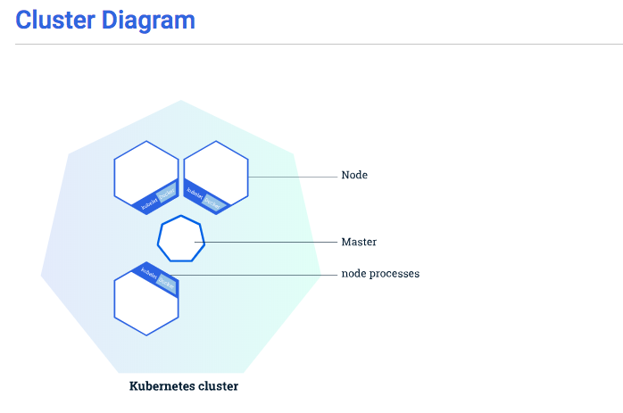
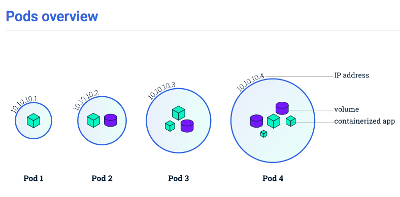
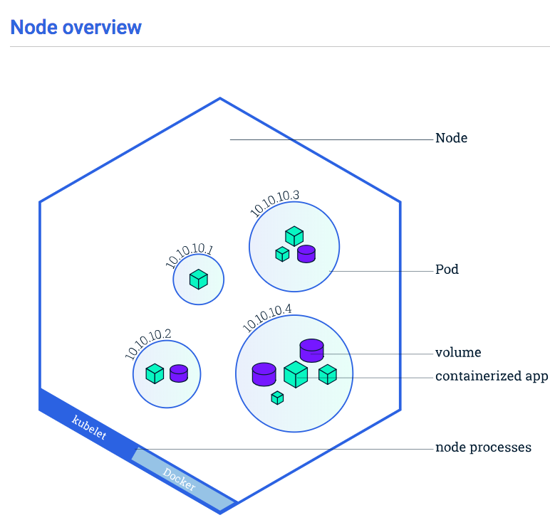
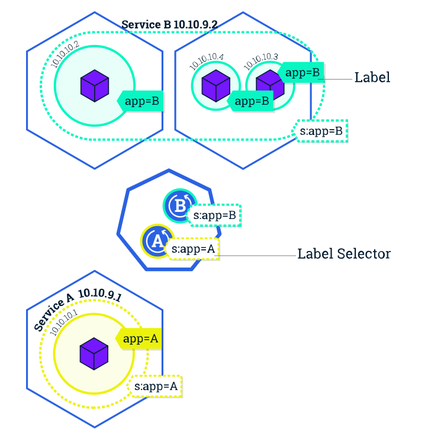
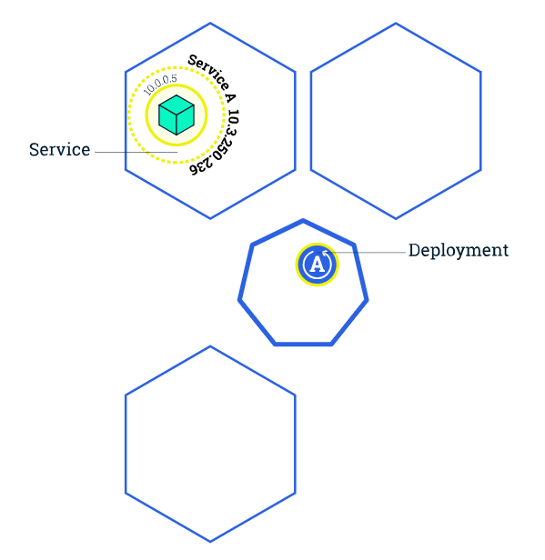
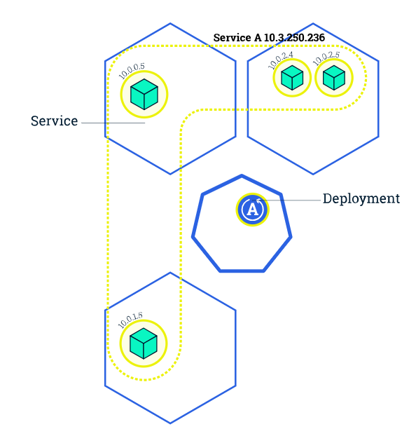
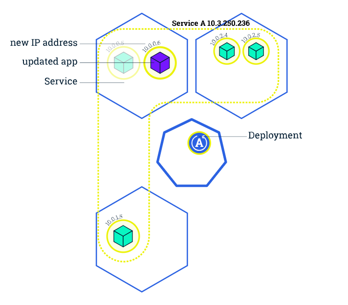
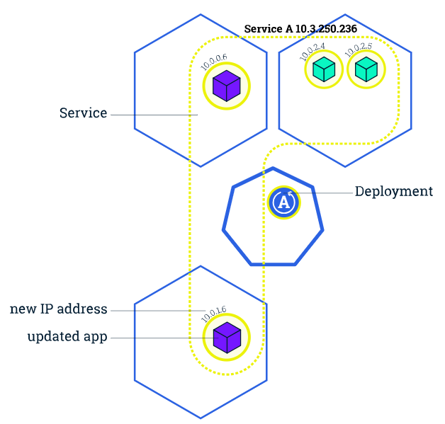
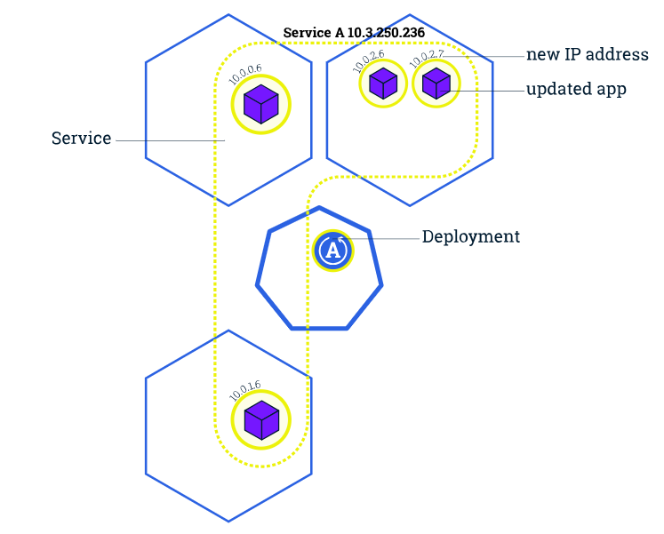

## 全体概要
- Pods : container群
- Node : サーバ。
  - master
  - worker
- Deployment : PodのDeploy・Scaling・RollUp(更新)の管理をする。Labelで関連づける。複数のPodとlinkできる。
- Services : Podsへのアクセスに関する設定を定義する。(LoadBalancerかとか)複数Podとlinkできる。
- Label : PodとDeploymentやServicesを結びつけるもの。
- Ingress : LoadBalancer

--- 
## kubectl コマンド一覧
```bash
# view the cluster details.
kubectl cluster-info

# 動かす対象のk8sクラスタを確認できる
kubectl config current-context


# gcloudのクラスタに切り替える
gcloud container clusters get-credentials [-z ${ZONE}] ${CLUSTER_NAME}

# 設定ファイルを指定して登録する
kubectl create -f ${YAML_FILE}

# 設定ファイルを更新する
kubectl replace -f ${YMLA_FILE}

# ディレクトリ単位でまとめて登録更新する
kubectl apply -f ${DIR_OR_FILE}


```

## Module1 クラスタの作成 "pod と nodes"
---
クラスタは２つののリソースを持つ。
- クラスタを管理するmaster
- アプリケーションを実行するnodes(worker)



### codes
- クラスタ作成時に作られるもの
  - node
  - service(後述。意味あるのか...?minikubeだけ？)
- ないもの
  - pods
  なんのコンテナもデプロイしてないし...
  - deployments
  コンテナデプロイしてないからない。

```bash
# view the cluster details.
kubectl cluster-info

# 動かす対象のk8sクラスタを確認できる
kubectl config current-context

# gcloudのクラスタに切り替える
gcloud container clusters get-credentials [-z ${ZONE}] ${CLUSTER_NAME}
```

## Module2 Deploy App
---

### codes
```sh
# これは単一のdokcerimageのdeployのやり方？
# kubectl run <NAME> <DockerIMAGE> port

```

## Module3 : Explore App(Appの情報取得) "pod と nodes"
---

### Pods
---
一つ以上のコンテナを持つk8sの最小単位。ノードに結びつけられている。
- Pods has 
  - Shared storage, as Volumes
  - Networking, as a unique cluster IP address
  - Information about how to run each container, such as the container image version or specific ports to use
- IPs are not exposed outside the cluster without a Service. 



### Nodes
---
workerでPodsを動作させる仮想or物理マシン。
各々のworker nodeはmaster nodeによって管理されている。
node内には複数のpodが存在でき、クラスタ内のnodesを横断的にpodsが管理されている。
- Kubelet, a process responsible for communication between the Kubernetes Master and the Node; it manages the Pods and the containers running on a machine.
- A container runtime (like Docker, rkt) responsible for pulling the container image from a registry, unpacking the container, and running the application.



### codes
---
- `kubectl get - list resources`
- `kubectl describe - show detailed information about a resource`
- `kubectl logs - print the logs from a container in a pod`
- `kubectl exec - execute a command on a container in a pod`

```sh

# 一覧を表示する
$ kubectl get pods [--all-namespaces]
NAME                                   READY     STATUS    RESTARTS   AGE
kubernetes-bootcamp-5c69669756-cdn9t   1/1       Running   0          2m

# 詳細を表示する
kubectl describe pod ${POD_NAME} [-n ${NAMESPACE}]

# 起動中のログを表示
kubectl logs ${POD_NAME}

# 
kubectl exec -it ${POD_NAME} sh

# tail -f のようにストリームで表示
kubectl logs -f ${POD_NAME}

# 前回起動時のログを表示
kubectl logs -p ${POD_NAME}
```

## Module 4 : Expose App (Appの公開)  "Services と Labels"
---
Podsは必ず死ぬ。
### Replication Controller
---
Podのレプリカ(複製)数を維持するための機能。ホストの障害などで少なくなったら増やし、増えすぎたら減らす。service内で定義(多分)

### Labels
---
key/valueのペア。ServicesとPodsを対応させる。
- Designate objects for development, test, and production
- Embed version tags
- Classify an object using tags

### Service
---
- PodsとそれらのAccess Policyを定義したもの。
- YAMLやJsonで定義される。
- A serviceが対象とするPodsのセットはLabelsにて決定される。
- serviceによってPods内のAppを外部に公開できる。
- Servicesは`type`を指定して複数の公開方法を選択出来る。
  - ClusterIP (default) - Exposes the Service on an internal IP in the cluster. This type makes the Service only reachable from within the cluster.(クラスタ内からのみのアクセス)
  - NodePort - Exposes the Service on the same port of each selected Node in the cluster using NAT. Makes a Service accessible from outside the cluster using `<NodeIP>:<NodePort>`. Superset of ClusterIP.(よくわからん)
  - LoadBalancer - Creates an external load balancer in the current cloud (if supported) and assigns a fixed, external IP to the Service. Superset of NodePort.(ロードバランサーにより固定外部IPを設定する)
  - ExternalName - Exposes the Service using an arbitrary name (specified by `externalName` in the spec) by returning a CNAME record with the name. No proxy is used. This type requires v1.7 or higher of `kube-dns`.


### codes
---
```bash
# クラスタ作成時にdefaultでserviceは作成されている
$ kubectl get services
NAME         TYPE        CLUSTER-IP   EXTERNAL-IP   PORT(S)   AGE
kubernetes   ClusterIP   10.96.0.1    <none>        443/TCP   1m

# create a new service expose and expose it
# serviceはpodsとではなくdeploymentを結びつける??
# kubectl expose <DEPLOYMENT NAME(??)/SERVICE NAME> --type=<EXPlabelOSE TYPE> --port <Port>
$ kubectl expose deployment/kubernetes-bootcamp --type="NodePort" --port 8080

# Deploymentはlabelを自動作成してくれる。
# run=kubernetes-bootcampというlabelsがあるはず。
$ kubectl describe deployment

# 新しいserviceができていることの確認
$ kubectl get services
NAME                  TYPE        CLUSTER-IP     EXTERNAL-IP   PORT(S)          AGE
kubernetes            ClusterIP   10.96.0.1      <none>        443/TCP          57s
kubernetes-bootcamp   NodePort    10.99.90.183   <none>        8080:31848/TCP   2s

# nodeport取得
$ export NODE_PORT=$(kubectl get services/kubernetes-bootcamp -o go-template='{{(index .spec.ports 0).nodePort}}')
echo NODE_PORT=$NODE_PORT

# クラスタ内からしかアクセスできない。(なぜこれで繋がる??)
$ curl $(minikube ip):$NODE_PORT

# -l はlabelのものだけを抜き出す
$ kubectl get pods -l run=kubernetes-bootcamp
$ kubectl get services -l run=kubernetes-bootcamp

# 新しいlabelをつける。複数のlabelをつけることが可能。
# OBJECTSはpod, service, deploymentなど(多分)
# kubectl label <OBJECTS> <NAME> <LABEL>
$ kubectl label pod $POD_NAME app=v1


# serviceの消去。
$ kubectl delete service -l run=kubernetes-bootcamp

# podは生きている。
$ kubectl exec -ti $POD_NAME curl localhost:8080
```

## Scale App
When traffic increases, we will need to scale the application to keep up with user demand.
Scaling out a Deployment will ensure new Pods are created and scheduled to Nodes with available resources. Scaling will increase the number of Pods to the new desired state. Kubernetes also supports autoscaling of Pods, but it is outside of the scope of this tutorial. Scaling to zero is also possible, and it will terminate all Pods of the specified Deployment.

Running multiple instances of an application will require a way to distribute the traffic to all of them. Services have an integrated load-balancer that will distribute network traffic to all Pods of an exposed Deployment. Services will monitor continuously the running Pods using endpoints, to ensure the traffic is sent only to available Pods.
Scaling is accomplished by changing the number of replicas in a Deployment.

Once you have multiple instances of an Application running, you would be able to do Rolling updates without downtime. We'll cover that in the next module. Now, let's go to the online terminal and scale our application.

 => 

### codes
scaleはDeploymentに適用させる。(今回は`kubernetes-bootcamp`(A)というDeploymentに適用。)
scaleにより、Deployment:Aと対応したPodの数が増減する。

- The DESIRED state is showing the configured number of replicas
- The CURRENT state show how many replicas are running now
- The UP-TO-DATE is the number of replicas that were updated to match the desired (configured) state
- The AVAILABLE state shows how many replicas are actually AVAILABLE to the users

```sh

# To list your deployments use the get deployments command: 
$ kubectl get deployments
NAME                  DESIRED   CURRENT   UP-TO-DATE   AVAILABLE   AGE
kubernetes-bootcamp   1         1         1            1           3m

# Next, let’s scale the Deployment to 4 replicas.
$ kubectl scale deployments/kubernetes-bootcamp --replicas=4

There are 4 Pods now, with different IP addresses.
$ kubectl  get pods -o wide
NAME                                   READY     STATUS    RESTARTS   AGE       IP            NODE
kubernetes-bootcamp-5c69669756-4lr6l   1/1       Running   0          1m        172.18.0.10   minikube
kubernetes-bootcamp-5c69669756-nxrrj   1/1       Running   0          10m       172.18.0.2    minikube
kubernetes-bootcamp-5c69669756-vw99r   1/1       Running   0          1m        172.18.0.8    minikube
kubernetes-bootcamp-5c69669756-vwqfv   1/1       Running   0          1m        172.18.0.9    minikube


```

## Update App
Users expect applications to be available all the time and developers are expected to deploy new versions of them several times a day. In Kubernetes this is done with rolling updates. Rolling updates allow Deployments' update to take place with zero downtime by incrementally updating Pods instances with new ones. The new Pods will be scheduled on Nodes with available resources.

In the previous module we scaled our application to run multiple instances. This is a requirement for performing updates without affecting application availability. By default, the maximum number of Pods that can be unavailable during the update and the maximum number of new Pods that can be created, is one. Both options can be configured to either numbers or percentages (of Pods). In Kubernetes, updates are versioned and any Deployment update can be reverted to previous (stable) version.

Summary:
Updating an app
Rolling updates allow Deployments' update to take place with zero downtime by incrementally updating Pods instances with new ones.
Similar to application Scaling, if a Deployment is exposed publicly, the Service will load-balance the traffic only to available Pods during the update. An available Pod is an instance that is available to the users of the application.

Rolling updates allow the following actions:

- Promote an application from one environment to another (via container image updates)
- Rollback to previous versions
- Continuous Integration and Continuous Delivery of applications with zero downtime


1  2  
3  4 

### codes
---
```bash
# deploymentにimageを新たにセットすると勝手にrollupしてくれる
$ kubectl set image deployments/kubernetes-bootcamp kubernetes-bootcamp=gcr.io/google-samples/kubernetes-bootcamp:v2

# podsが死んだり立ち上がっているのを確認する。
kubectl get pods

# podsのimageが変化しているのも確認する。
kubectl describe pods

# The update can be confirmed also by running a rollout status command:
$ kubectl rollout status deployments/kubernetes-bootcamp

# imageがない場合(v10はない)、podの更新がされない。
$ kubectl set image deployments/kubernetes-bootcamp kubernetes-bootcamp=gcr.io/google-samples/kubernetes-bootcamp:v10

# podの状態を元に戻す
kubectl rollout undo deployments/kubernetes-bootcamp


```

## minikubeによるローカル実行
```bash
# Kubernetesクラスタの作成
# (多分)defaultでminikubeという名前
$ minikube start

# ここで対象クラスタ確認するとminikubeに
$ kubectl config current-context
minikube

# これで無理くり変えることも可能
# kubectl config use-context <クラスタ名>
$ kubectl config use-context minikube
Switched to context "minikube".
$ kubectl config current-context
minikube

 
```


