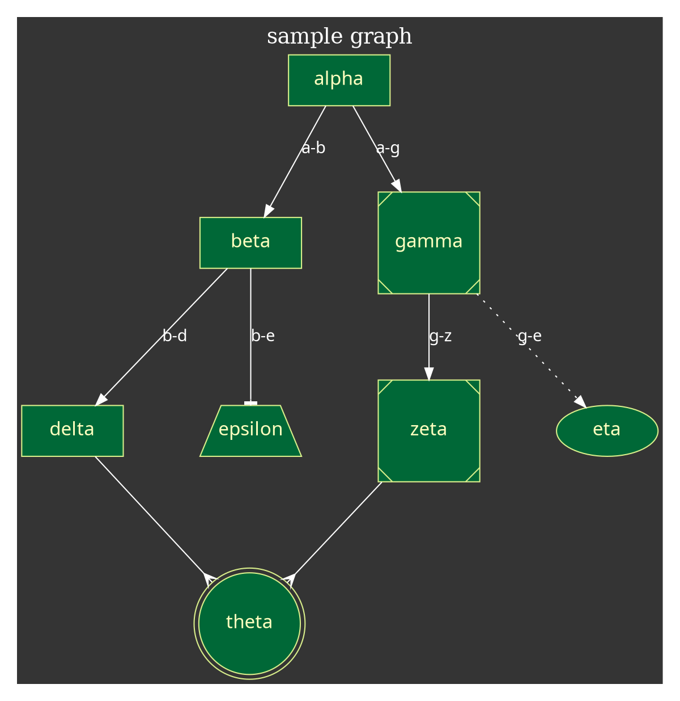

## 統計学と機械学習
参考URL：[「統計学と機械学習の違い」はどう論じたら良いのか](https://tjo.hatenablog.com/entry/2015/09/17/190000)
- 機械学習
**目標：データからの「予測」すること。**
教師なし学習なら「データ同士の類似度合い」の予測。(次元削減とかは、統計学っぽい気もする...?)
強化学習なら「最適な行動」の予測
- 統計学
**目標：データの特徴を「説明」すること。**
- 

## 機械学習の概要

- 教師あり学習
入力とその答えがあるデータに対して、答えの予測を行う手法。
  - 回帰問題
  連続値を予測する。
  - 分類・識別問題
  カテゴリデータを予測する。
- 教師なし学習
入力のみが与えられた時に、そこから
  - クラスタリング
  - 次元削減
- 強化学習
最終的な目標(ラベル?)はあるが、その時点で最適な行動が明確に分からない状況で最適な行動選択を行うための手法。状態・行動・報酬(実際の目標達成)・価値(報酬により近づいた事、多分)が与えられる。
  - 参考URLまとめ
    - [強化学習入門 ～これから強化学習を学びたい人のための基礎知識～](http://blog.brainpad.co.jp/entry/2017/02/24/121500)
    - [【強化学習初心者向け】シンプルな実装例で学ぶQ学習、DQN、DDQN](https://qiita.com/sugulu/items/bc7c70e6658f204f85f9)
    - [ゼロからDeepまで学ぶ強化学習](https://qiita.com/icoxfog417/items/242439ecd1a477ece312)
  - 具体例
    - バスケのシュート。目標は「リングにボールを入れる」。行動は「投げる力」「方向」「回転の掛け方」etc...。状態は「ゴールまでの向き」「ゴールまでの距離」etc...。最適な行動は人間にはわからないが目標はわかる。
    - 囲碁。目標は「相手の陣地より自分の陣地を多くする」。行動は「石の置く場所」。状態は「囲碁盤の状態」。こちらも目標は決定しているが、時々の最適解は簡単に判断できない。
    - 其の他、某立てゲーム、株の売買、自動二足歩行、etc...
    - 

[ディープラーニングの判断根拠を理解する手法](https://qiita.com/icoxfog417/items/8689f943fd1225e24358)

1.判断根拠を理解することの意義
既存のディープラーニングでは出力結果に対する判断過程がブラックボックス化されている。

2.判断根拠の「理解」の定義

3.学習されたネットワークの「説明」に挑戦する

4.説明力の評価
説明力を評価する方法について。

- 説明の一貫性
- 説明の正当性

5.応用事例
DNNの判断根拠を説明することによりどのような社会的利益が得られるのか。

---
# kaggleについて
## アンサンブル学習の仕方
[Stacked Generalizationで分類器のスコアをひねり出す](https://qiita.com/sergeant-wizard/items/d1509f71943b429929cf)

# 損失
損失関数によってアルゴリズムが変わってくる。(代理損失・etc...)

