# 概要
ベイズ統計学は「結果から原因を推定する」と言う考え方。
$$f(\theta|D) = \frac{f(D|\theta)f(\theta)}{f(D)}  $$
$f(\theta|D)$ は事後分布  
$f(D)$ はエビデンス
$f(D|\theta)$ は尤度関数
$f(\theta)$ は事前分布

## 目標
今までの観測値Dから$\theta$(事後分布)を求めること。新しい観測値Dの予測が可能に。
## アプローチ
0.  データから統計的なものを予測
1.  0の情報に基づき統計モデルを作成
2.  計算する。
    1. 自然共役事前分布を使用して真面目に手計算(パラメータ２つなので難しい。)
    2. **MAP推定** : $\theta$の確率分布全体では****なく、事後分布が最大の点だけを求める。
    3. **MCMC** : 事後分布サンプリング。

頻度論的思考：$\theta$は定数
ベイズ的思考：$\theta$は確率変数(確率分布をとる) 

## b : MAP推定による求め方
MAP推定は$f(\theta | D)$が最大となる$\theta$の値(定数)を求める方法。
事後分布を求めるには、尤度関数$f(D|\theta)$と事前分布$f(\theta)$が必要。
しかし、MAP推定では事前分布$f(\theta)$を無情報事前分布を想定することで
尤度関数の最尤推定を行えば良い。
$\theta_{MAP} = {argmax}\ f(D|\theta) = {argmin}(-log_{10}\ f(D|\theta))$

## c : MCMC(Marcof Chain Monte Calro)による求め方
### モンテカルロ法
乱数を使った数値計算手法。(例:円周率等)

### 棄却サンプリング
複雑な事後分布をモンテカルロ法を用いてサンプリングする方法。
例：beta分布 : $Beta(x|\alpha, \beta) = \frac{1}{B(\alpha, \beta)}x^{\alpha - 1}(1-x)^{\beta - 1}$ 
**目標分布** :  Beta分布f(x)
**提案分布** :  サンプリングが簡単な一様分布g(x)。ただし$f(x) <= Mg(x)$(結局はf(x)をすっぽり覆う一様分布。)

### MCMC
1. 初期値$\theta_0$を求める。
2. 乱数で新しい$\theta_{new}$を求める。(**マルコフ連鎖**)
3. $f(\theta_{new} | D) > f(\theta_0|D)$ かどうか判断。
4. 真であれば状態を更新。偽で会ってもある程度の確率で状態を更新。
5. 2 - 4を繰り返す。

こうすることで最大の$\theta$となる値の周辺を$\theta_{new}$がうろつく。
確率過程 : $\theta_1$ -> $\theta_2$ -> ... -> $\theta_n$ のような状態の変化の推移
マルコフ性 : 新しい状態$\theta_t$が直前の状態$\theta_{t - 1}$のみから決定する確率過程
例：大学生の教室移動

#### 詳細釣り合い
$f(\theta`|\theta)f(\theta) = f(\theta | \theta`)f(\theta`)$
ある一定の確率分布に収束するために満たす条件である。

しかしながら、詳細釣り合いするような遷移核$f(\theta | \theta`)$を見つけることは容易でないし、遷移核に従う乱数を発生させるのも簡単でない。

- **M-Hアルゴリズム**
$q(\theta)=q(\theta`)$となるような遷移核qを定義(ランダムウォーク等)と詳細釣り合いを満たすように補正係数rを定義。
$rq(\theta`|\theta)f(\theta) = q(\theta | \theta`)f(\theta`)  \\ 
i.e. r = \frac{q(\theta | \theta`)f(\theta`)}{q(\theta`|\theta)f(\theta)}$
  1. $\theta$の初期値を決める
  2. 次の$\theta'$を決める。
  3. r の値を求める。
  4. r < 1ならrの確率で$\theta'$を受容、r > 1なら必ず$\theta'$受容する。
  5. 2~4をn回繰り返す。
- **Gippsサンプラー(サンプリングしたいパラメータがの複数時の場合)**
例えばパラメータ$(\theta_1,\theta_2,\theta_3)$に関して
ある一つの$\theta_1$以外のパラメータを固定して考える手法。
- **ハミルトニアンモンテカルロ**
ハミルトニアン=運動エネルギー+ポテンシャル
$H(p,q) = \frac{p^2}{2m} + U(q)$(pは運動量、qは位置、Hは一定)
  1. ハミルトニアンを構成する(U(q)を決める)
  2. ハミルトン方程式を解き、(p,q)の経路を求める。
H一定により導き出されるハミルトン方程式は以下。
$$\frac{\delta H}{\delta p} = \frac{\delta q}{\delta t} \\
\frac{\delta H}{\delta q} = - \frac{\delta p}{\delta t} $$

---
## ベイズ統計学
「結果から原因を推定する」、と言う考え方。
(例：道路に水たまりがある => 雨が降ったんじゃないか？誰かが水をこぼした？)
以上のような考え方は、すべてベイズである統計学に基づいていると言える！

## 応用例

- ベイズ統計モデルに基づく統計解析(単回帰分析・重回帰分析・改造ベイズなど)
- スパムメールの分類(ナイーブベイズ)
- 時系列データの解析(状態空間モデル)

---
# 確率・基礎
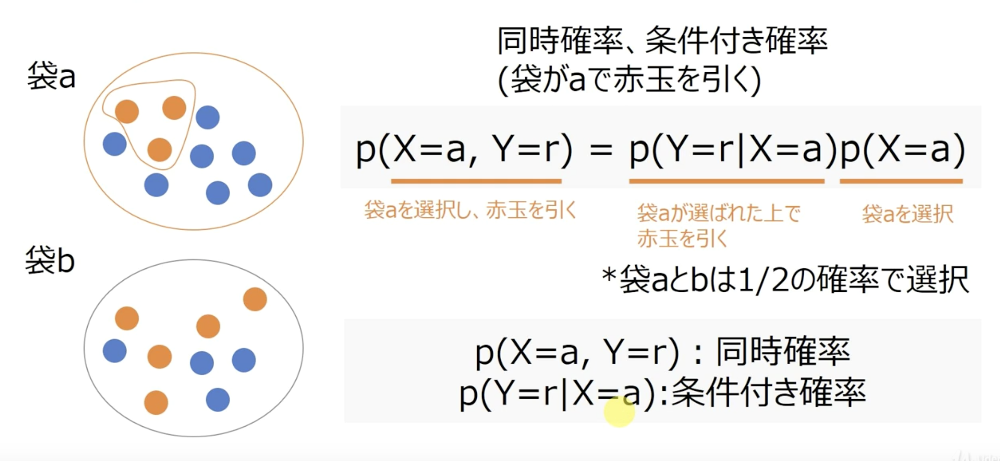
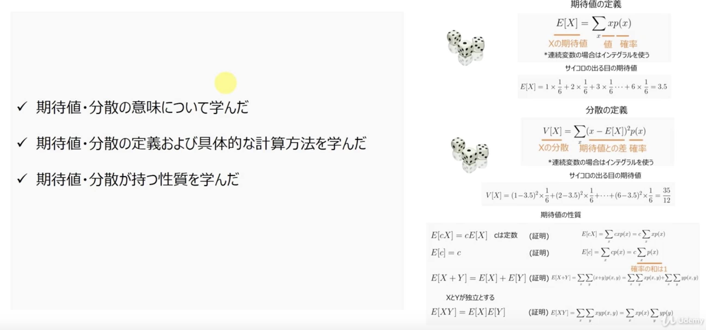

---
# ベイズ統計学の基礎

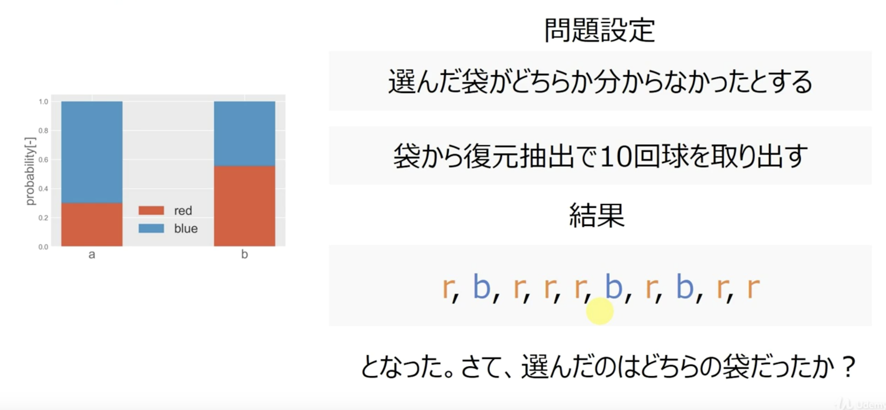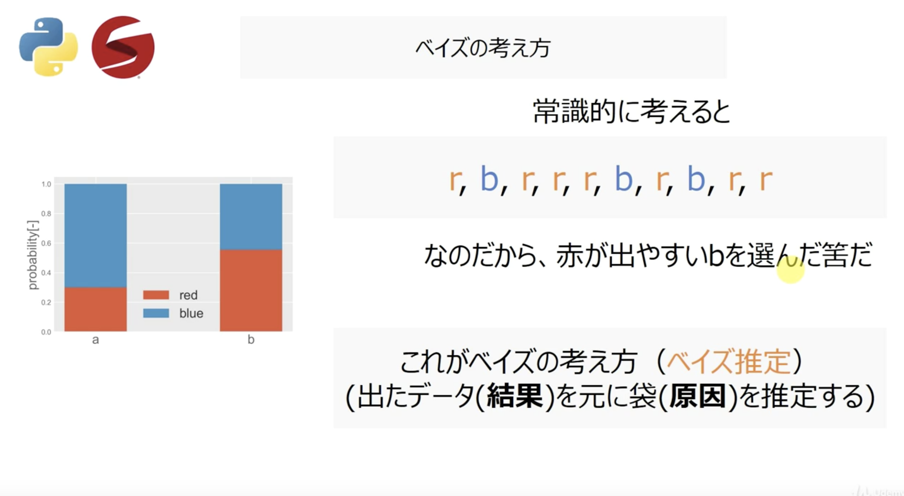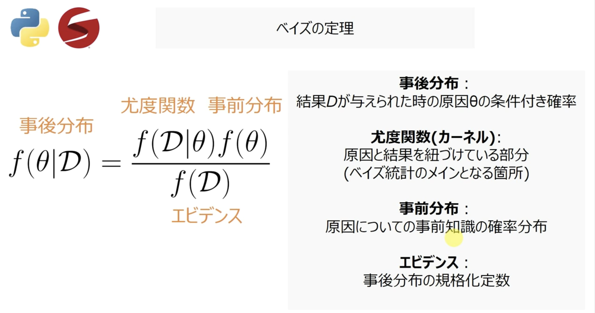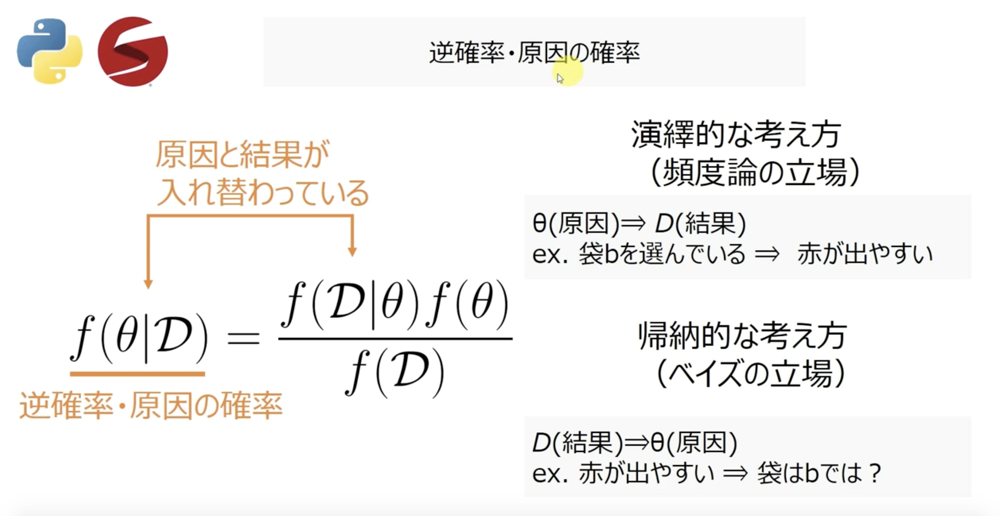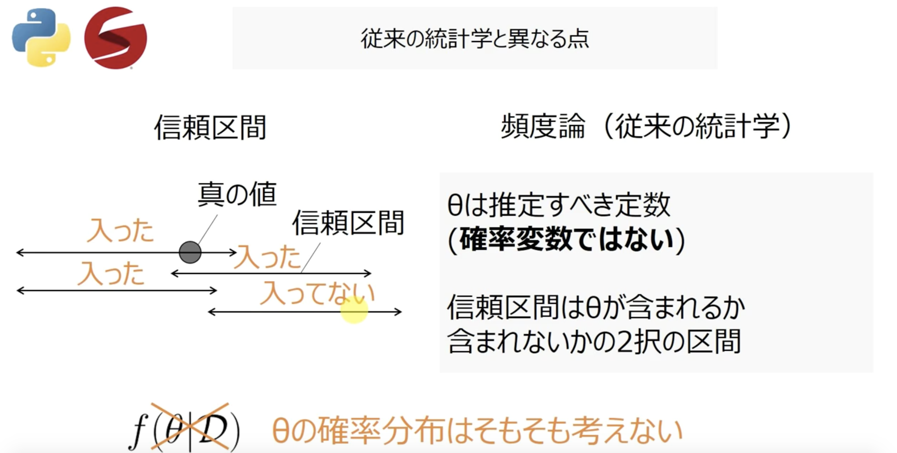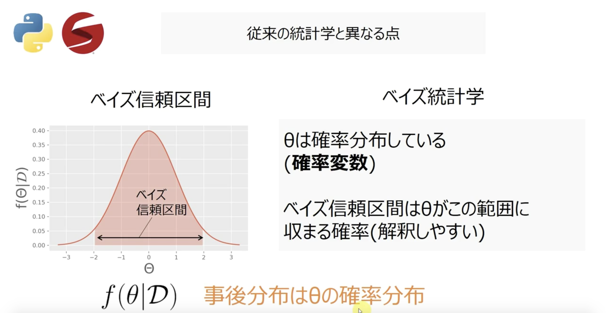

---
# ベイズ統計の流れ

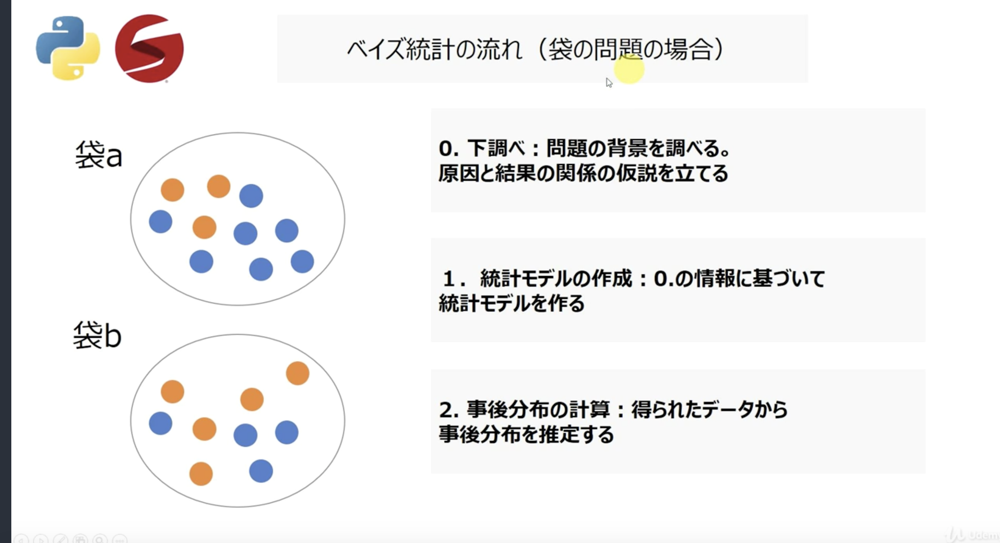

事後学率を求めたい。
そのために
- $f(w|D)$(尤度関数)
- $f(\theta)$(事前分布)

が求まれば良い。

1. 下調べ
経験によると袋aが求めやすい。袋からどれぐらいの頻度で玉が出てくるかが知っている。(今回はすでに個数を知っているものとする。)
1. 統計モデルの作成
下調べでの知見に基づいて、統計モデルを選定・作成する。
(例：サイコロならベルヌーイ。身長とかなら正規分布。)
2.計算を行う
通常はMCMC(マルコフチェーンモンテカルロ法)により計算。

---
# 確率分布・自然共益分布
## 色々な確率分布
### ベルヌーイ分布

### 二項分布
### ベータ分布
### 正規分布
### 指数分布
### ポアソン分布
### ガンマ分布

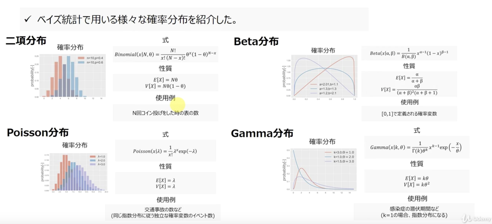

## 自然共益分布
以下の例のように
**(事後分布の形) = (事前分布の形)**
が成り立つような事前分布を
**自然共益分布**と言う。

$$a^5(a-1)^3 = a^3(a-1)^2 \times a^2(a-1)  \\
事後分布 \,\,\,\,\,\,\,\,\,\,\,\, 事前分布\,\,\,\,\,\,\,\,\,\,尤度関数 \,\,\,\,\,\,\,\,\,\,\,\,\,\,\,\,\,\,\,\,\,$$

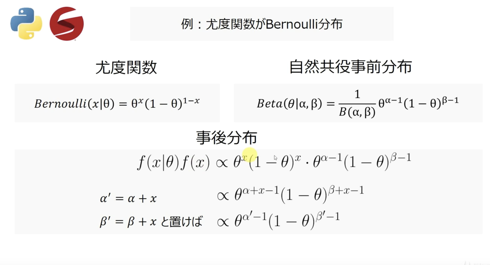

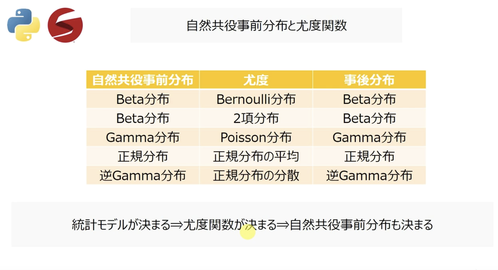

---
# 様々な確率分布

