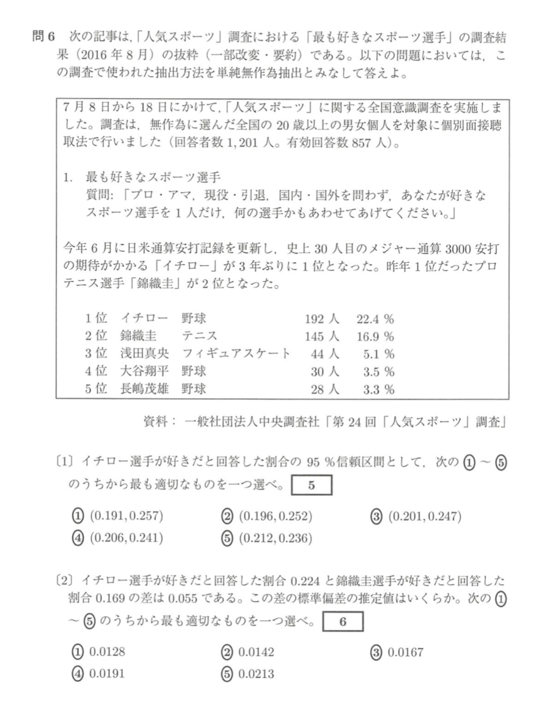
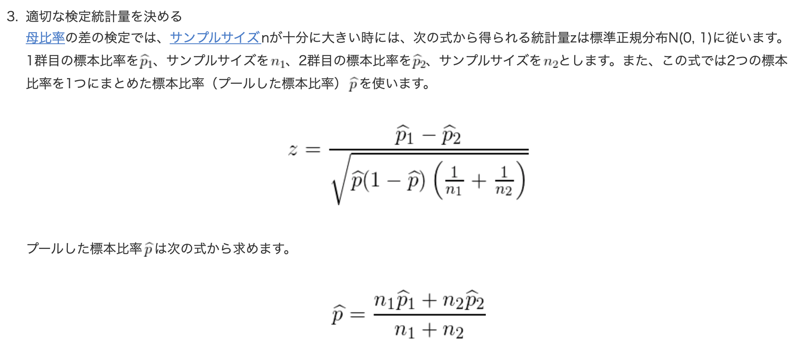
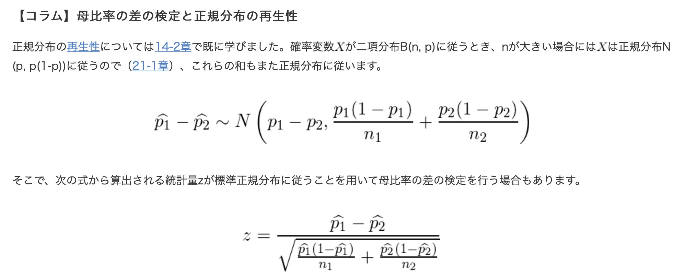
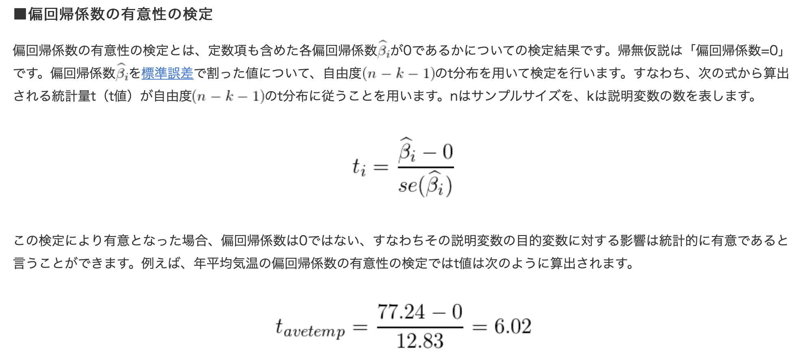

最終見直し

## 差の検定
- 2群の場合
    - 母分散が等しいと考えられる時
      - 2群のサンプル数が同じ($n_1 = n_2$)の時
          $X_1 - X_2$と$S(X_1-X_2)$を求めて、母平均の区間推定or$X_1 - X_2 = 0$となるような検定。
      - 2群のサンプル数が異なる場合：
          $$Z = \frac{(\bar{x_1} - \bar{x_2}) - (\mu_1 - \mu_2)}{\sqrt{s_p^2(\frac{1}{n_1} + \frac{1}{n_2})}} , s_p = \frac{(n_1 - 1)s_1^2 + (n_2 - 1)s_2^2}{n_1 + n_2 - 2}$$
    - 2群の母分散が等しいと限らないとき：
      - Welthのt検定
        $$t = \frac{\bar{x_1} - \bar{x_2}}{\sqrt{\frac{s_1^2}{n_1} + \frac{s_2^2}{n_2}}} \sim t(v) \  (\because v \approx \frac{(s_1^2/n_1 + s_2^2/ n_2)}{\frac{s_1^4}{n_1^2(n_1- 1)} +  \frac{s_2^4}{n_2^2(n_2 - 1)} } (暗記不要)) $$
- 3郡以上の場合(検定)：
  - 分散分析
    F分布を用いて各水準の差があるかどうかを調べる。
    - 一元配置分散分析(因子が一種類、水準は3以上)
    - 二元配置分散分析
    - 多順配置分散分析
  - 多重比較検定
    分散分析では因子の水準間で平均値に差があることはわかっても、どの水準間で差があるのかはわからない時に多重比較する。一種として全ての2水準間の差を検定する「turkey法」がある。(多重性により、第1種の過誤の可能性が大きくなる。)

## 差の検定(確率の差)

  - 問題
    - 
    - 
  - 参考
    - 
    - 
  - ポイント
    - 分母の$\hat{p}$はプールしたものになるかもしれないし、$\hat{p_1}, \hat{p_2}$になるかもしれない。
    - ただし、分母に絶対$\frac{1}{n_1} + \frac{1}{n2}$が入る。(正規分布の分散を考える)
    - $covv(p_1, p_2) = - np_1p_2$

## 重回帰分析
- 遍回帰係数の優位性検定
  - 
  - 自由度はn-k-1

## 効果量
差の効果を表す。
- 効果量
  2変数間の「検出したい差の程度」や「変数間の関係の強さ」の値。p値はサンプルサイズによるため、サンプルサイズによらない値として考案されている。
  - d族(差の大きさを表す)
    - Cohenのd
      $$ d = \frac{| \bar{x}_1 - \bar{x}_2 |}{s_c} , s_c = \sqrt{\frac{n_1 s_1^2 + n_2 s_2^2}{n_1 + n_2}}$$
    - Hedgeのg
      $$ g = \frac{| \bar{x}_1 - \bar{x}_2 |}{s_d} , s_d = \sqrt{\frac{(n_1 - 1) s_1^2 + (n_2 - 1) s_2^2}{n_1 + n_2 - 2}}$$

## 時系列分析
- レバレッジ(てこ値)
    各データがどのくらいモデルに対する影響度を持つかを示す。大きな値は外れ値とみなせる。
- cookの距離
  あるデータxを使った時と使わなかった時の予測式の係数の差。0.5以上だと、異常値とみなせる。
- コクランオーカット??? 
- ランダムウォーク・ブラウン運動
  $$S_0 = s, S_T = \sum_t^T X_t$$
  下記はランダム・ウォークと呼ばれる。(p=q=1/2なら単純ランダムウォーク。)
  $$P(X_t = d) = p, \ P(X_t = -d) = q = 1-p$$
  $$E(S_t) = 0, \ V(S_t) = tV(X) $$
  $$(対称ランダムウォークの時 \ E(S_t) = 0, V(S_t) = t)$$
- 定常性
    平均と分散がtによらず一定。
    ARモデル$y_t = ay_{t-1} + b + \epsilon_t (|a| < 1)$は定常過程。

- 共分散モデル