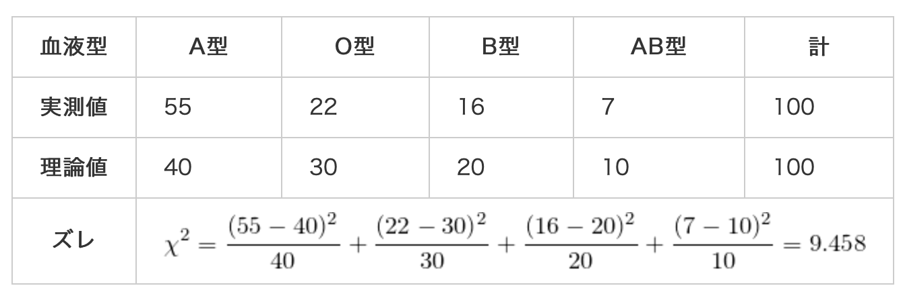
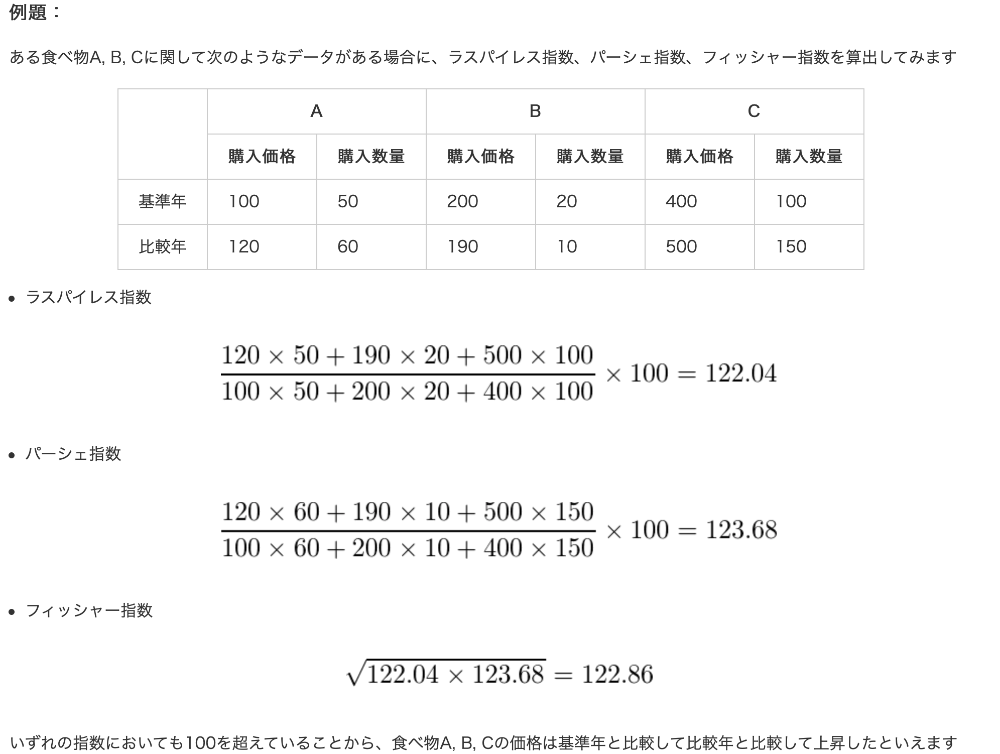

# 重点的にやるべき範囲
- 二級範囲
  - 確率と確率変数
  - 種々の確率分布
  - 統計的推測(推定)
  - 統計的推測(検定)
- 二級以外範囲(現状は予測)
  - 回帰分析や機械学習
  - 多変量解析
  - ベイズ法
  - マルコフ連鎖と確率過程
  - カーネル
- 二級大項目内でまだしてない小項目
  - モーメント 母関数
  - 分布すべて
  - モーメント法
  - ガウスマルコフの定理、クラーメル・ラオの不等式
  - 片側信頼限界(区間推定)
  - 検出力曲線
  - ネイマンピアソンの基本定理・尤度比検定・ワルド型検定・スコア検定
  - ノンパラメトリック法の検定
- ダービン・ワトソンの統計量([出展](https://ds.machijun.net/統計検定-準1級に受かったので勉強法を/))
- EMアルゴリズム

以下参考書籍。
- 参考書籍
  - 統計的学習の基礎(機械学習分野対策EMアルゴリズムやギブスサンプリングなど)
  - 多変量解析入門(重要)
  - 

# 前提
- $X,Y$...：確率変数
- $x \in X$：確率変数が取る値
- $E(X)$：Xの期待値(平均)
- $V(X)$：Xの分散
- $\sigma^2$ : 母分散
- $\mu$ : 母平均
- $p$：母比率
- $s^2$ : 標本分散
- $\bar{x} \ or \  \hat{\mu}$ :標本平均
- $p$：標本比率
- $\hat{y}$ : 推測値

# 信頼区間・検定における分布

## 分布使い分け
- 母平均の平均値
  -   母分散既知の時
    $$X = \frac{\hat{\mu} - \mu}{\sqrt{\frac{\sigma^2}{n}}} \sim N(\mu, \sigma^2/n)$$
  -   母分散未知の時
    $$t = \frac{\hat{\mu} - \mu}{\sqrt{\frac{s^2}{n}}} \sim t(n-1)$$
- 母平均の差：
  - 2群の場合
    - 母分散が等しいと考えられる時
      - 2群のサンプル数が同じ($n_1 = n_2$)の時
          $X_1 - X_2$と$S(X_1-X_2)$を求めて、母平均の区間推定or$X_1 - X_2 = 0$となるような検定。
      - 2群のサンプル数が異なる場合：
          $$Z = \frac{(\bar{x_1} - \bar{x_2}) - (\mu_1 - \mu_2)}{\sqrt{s_p^2(\frac{1}{n_1} + \frac{1}{n_2})}} , s_p = \frac{(n_1 - 1)s_1^2 + (n_2 - 1)s_2^2}{n_1 + n_2 - 2}$$
    - 2群の母分散が等しいと限らないとき：
      - Welthのt検定
        $$t = \frac{\bar{x_1} - \bar{x_2}}{\sqrt{\frac{s_1^2}{n_1} + \frac{s_2^2}{n_2}}} \sim t(v) \  (\because v \approx \frac{(s_1^2/n_1 + s_2^2/ n_2)}{\frac{s_1^4}{n_1^2(n_1- 1)} +  \frac{s_2^4}{n_2^2(n_2 - 1)} } (暗記不要)) $$
  - 3郡以上の場合(検定)：
    - 分散分析
      F分布を用いて各水準の差があるかどうかを調べる。
      - 一元配置分散分析(因子が一種類、水準は3以上)
      - 二元配置分散分析
      - 多順配置分散分析
    - 多重比較検定
      分散分析では因子の水準間で平均値に差があることはわかっても、どの水準間で差があるのかはわからない時に多重比較する。一種として全ての2水準間の差を検定する「turkey法」がある。(多重性により、第1種の過誤の可能性が大きくなる。)
- 母比率：
    $$Z = \frac{\hat{p} - p}{\sqrt{\frac{p(1-p)}{n}}} , (\because Z = \frac{X - np}{\sqrt{np(1-p)}}), E(X)=np, V(x)=np(1-np))$$
- 母比率の差：(正規分布の再生性よりいかに従うことを利用。)
    $$ p_1 - p_2 \sim N(p_1 - p_2, \frac{p_1(1 - p_1)}{n_1} + \frac{p_2(1 - p_2)}{n_2}))$$
- 母分散の区間推定・検定：
    $$\chi^2 = \frac{(n-1)s^2}{\sigma^2} \sim \chi(k) $$
- 母分散の差の検定(等分散性検定)：
  - F分布による検定。
- 適合度の検定
  - 理論値に対して実測値がどれくらいズレているかを検定する。
    実測値を$x_i$、理論値を$y_i$とすると、以下で定義でき、片側検定をする。
    $$\chi^2 = \sum_{i}{\frac{(x_i - y_i)^2}{y_i}} \sim  \chi^2(i-1) $$
    

# 用語・指標
- 変動係数
  平均値に対するデータのばらつきを相対的に評価する単位のない指標
  $$CV = \sigma / \mu$$
- 価格指数
    $p = price, q = quantity$
    $$p_{0i}：基準年の価格　p_{ti}：比較年の価格\\
    q_{0i}：基準年の数量　q_{ti}：比較年の数量$$
  - ラスパイレス指数
    $$P_L = \frac{\sum_{i=1}^n p_{ti}q_{0i}}{\sum p_{0i}q_{0i}} \times 100
    \ (比較年価格 \times 基準年数量 / 基準年価格 \times 基準年数量)$$
  - パーシェ指数
    $$P_P = \frac{\sum_{i=1}^n p_{ti}q_{ti}}{\sum p_{0i}q_{ti}}  \times 100
    \ (比較年価格 \times 比較年数量 / 基準年価格 \times 比較年数量)$$
  - フィッシャー指数
    $$\sqrt{P_L \times P_P}$$
    

- 回帰係数
  - 重回帰分析
  - DW(ダービーワトソン統計量)
    DWと一次の事項相関係数$\hat{p}$は以下の関係式になる。
    $$DW = 2 - 2\hat{p}$$

- 決定係数
  - 

- 効果量
  2変数間の「検出したい差の程度」や「変数間の関係の強さ」の値。p値はサンプルサイズによるため、サンプルサイズによらない値として考案されている。
  - d族(差の大きさを表す)
    - Cohenのd
      $$ d = \frac{| \bar{x}_1 - \bar{x}_2 |}{s_c} , s_c = \sqrt{\frac{n_1 s_1^2 + n_2 s_2^2}{n_1 + n_2}}$$
    - Hedgeのg
      $$ g = \frac{| \bar{x}_1 - \bar{x}_2 |}{s_d} , s_d = \sqrt{\frac{(n_1 - 1) s_1^2 + (n_2 - 1) s_2^2}{n_1 + n_2 - 2}}$$

- 検出量
- ネイマンピアソン(?)
- ネイマン配分
  幾つかの層(グループ)に分割して推定量を求める場合を考える。
  分散を最も小さくするための層毎の標本数の比は、層毎の標準偏差が既知であるとき、「層の大きさ(層のデータ数) x 層の標準偏差」で配分すれば良い。

# 多変量解析

# 非線形モデル
- p次元の説明変数：$\bm{x}$
- 目的変数：$Y$
- 観測されたデータ：$(\bm{x_i}, y_i; i=1,2,...,n))$
- 基底関数：$\{b_1(\bm{x}) (= 1) , b_1(\bm{x}), b_2(\bm{x}), ..., b_m(\bm{x}) \}$
- パラメータ：$\bm{w} = \{ w_0, w_1, w_2, ..., w_m\}^T$
全てのモデルは以下の式のように一般化できる。
$$y_i = \sum_{j=0}^{m} w_jb_j(\bm{x_i}) + \epsilon_i, \ \ \ i= 1,2,...,n$$
> 基底関数は、ある関数を表す元となる関数群。例えば、線形回帰モデル(重回帰モデル)は$b_j(\bm{x}) = x_j$で表せるし、m次多項式モデルは$$

## スプライン
n組の観測データに対して一つの多項式を当てはめるのではなく、区間ごとに複数多項式を当てはめる手法。
説明変数${{x_1, x_2, ... , x_n} \in X}$に対して3次スプラインは以下の式で定義される。
$$u(x; \bm{\theta}) = \beta_0 + \beta_1x + \beta_2x^2 + \beta_3x^3 + \sum_{i=1}^{m} \theta_i(x-t_i)^3_+ \\
(\because \bm{\theta} = (\beta_0,\beta_1,\beta_2,\beta_3,\theta_1,\theta_2, ..., \theta_m)^T, \  (x - t_i)_+ = max\{0, x-t_i\}) $$
すなわち、スプラインの基底関数は以下になる。
$$1, x, x^2, x^3, (x-t_1)^3_+, (x-t_2)^3_+, ..., (x-t_m)^3_+$$
- 自然3次スプライン
  3次スプラインに対して両端区間では一次式であるという条件を付加したもの。
- B-スプライン
  複数の多項式を滑らかに接続して一つの基底関数を構成したもの。

# 生存関数

