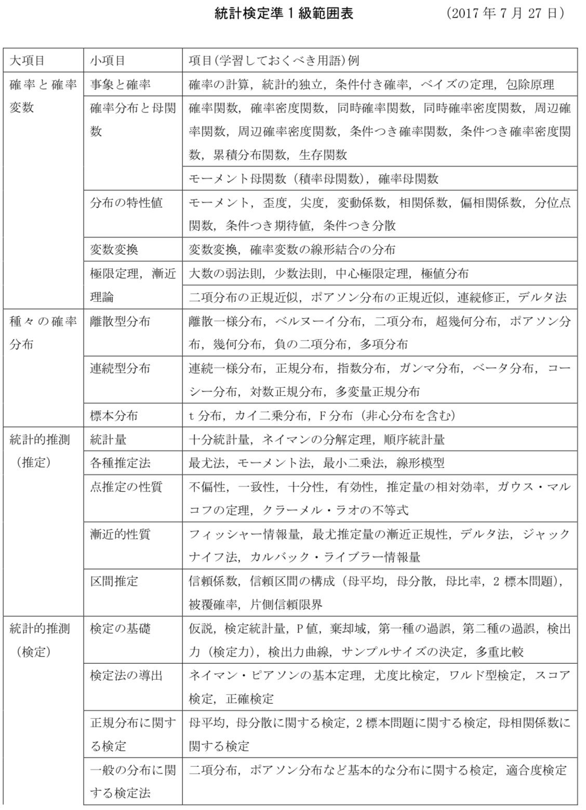
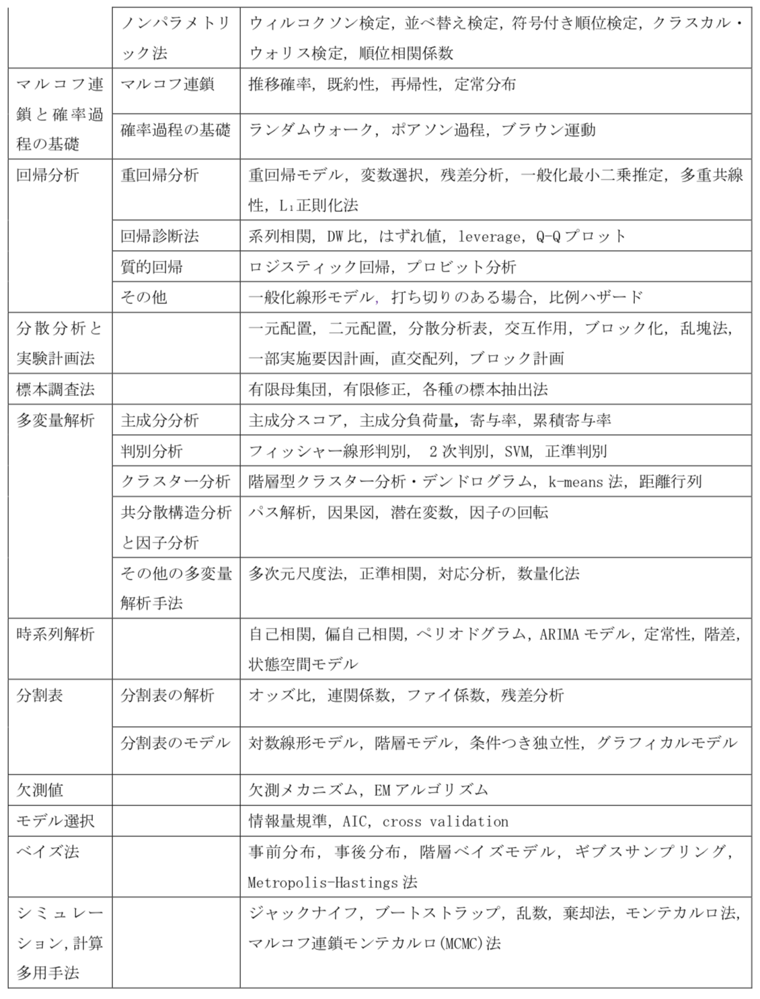

## 最終復習
- 
- 効果量
  差の効果を表す。
  $$\frac{\bar{x_1} - \bar{x_2}}{s_p}  \ (\because s_p = \sqrt{\frac{n_1 s_1 + n_2 s_2}{n_1 + n_2}})$$
- レバレッジ(梯子)
  - cookの距離
  - はしご？
- 共分散モデル
- コクランオーカット
- ランダムウォーク・ブラウン運動
  $$S_0 = s, S_T = \sum_t^T X_t$$
  下記はランダム・ウォークと呼ばれる。(p=q=1/2なら単純ランダムウォーク。)
  $$P(X_t = d) = p, \ P(X_t = -d) = q = 1-p$$
  $$E(S_t) = 0, \ V(S_t) = tV(X) $$
  $$(対称ランダムウォークの時 \ E(S_t) = 0, V(S_t) = t)$$

## やっときたいところ・怪しいところ
- SVM
- フィッシャーの線形判別
- 効果量
- 時系列情報
  - 定常性
    平均と分散がtによらず一定。
    ARモデル$y_t = ay_{t-1} + b + \epsilon_t (|a| < 1)$は定常過程。
  - ベリオドグラム
- コクランオーカット
- その他多変量解析(なんかどれかでそうな気がする！)
- (並べ替え検定・順位検定・順位相関検定・順位相関検定)

- 回帰分析：比例ハザード
- 確率過程：ブラウン運動
- ロジスティック回帰
- 因子の回転
- ギブスサンプリング

## 他まだ出てないところ

### マジで知らんやつ
- マジで知らんやつ
  - 分布系
    - ガンマ分布
    - ベータ分布
  - 十分統計量・ネイマンの分解定理
  - 漸近的性質
    - デルタ法
    - ジャックナイフ法
    - カルバックライブラー情報量
  - 検定法の導出
    - 尤度比検定
  - 共分散構造分析
    - パス解析

## 統計検定2級2018/11月間違えたところ
- 復習
  - 解けてない：18,19,26,32,v
  - 絶対：6,7,8,9,12,13,17,18,19,25,26,27,29,32
  - 一応：14,15,22??,24??,

## 統計検定2級2016/11月間違えたところ
- 復習
  - 解けてない：8,12,20
  - 絶対：3,6,7,8,12,15,19,20,25,28,29,31,33
  - 一応：14,15,22??,24??,
- 評価
  - 標本調査の種類把握
  - [ ] 回帰係数の標準誤差について 12
  - [x] 検定の検出力について　29
  - [x] 母平均が違う時の検定について
  - [ ] 母平均・母分散・母比率やその差のの検定における従う分布と自由度について

重回帰分析：残渣の標準誤差とは??

## 統計検定準1級2016/6月間違えたところ
- 復習：全部
  - 解けてない
    - 記述：1,2,7,8
    - 選択：1,4,5,6,7,8,9,10,11,13,15,17,18,19,20,22
  - なぞ
    - 選択5:検出力

## 統計検定準1級2017/6月間違えたところ
- 復習：全部
  - 解けてない
    - 記述：8,9
    - 選択：4,8,17,20
  - 間違えた
    - 記述:大門1,2
    - 選択:1,2,4,6,7,8,9,14,16,17,18,22,24
  - なぞ
    - 洗濯 9 コクランオーカット
  - 復習要素
    - 多項分布におけるv(x)の差。Covv(X1,X2)は？
    - 二変量正規分布の扱い(まだ)
    - 時系列データの自己相関の出し方・コレログラム・ダービンワトソン・コクランオーカット
    - 繊維系行列の順番ちゃんと考える。

## 統計検定準1級2018/6月間違えたところ
- 復習：全部
  - 解けてない
    - 記述：1,2,3,4,5,6
    - 選択：4,5,12,13,14
  - 間違えた
    - 選択:2,5,7,12,13,14,16,19
  - 問題
    - 時系列データARモデル・過程とは何か
    - カーネルの多項式カーネル・ガウスカーネルについて
    - モンテカルロの復習

## 公式準一級出題範囲
---

- 回帰分析：比例ハザード
- 確率過程：ブラウン運動
- ロジスティック回帰
- 因子の回転
- ギブスサンプリング
- 包除原理