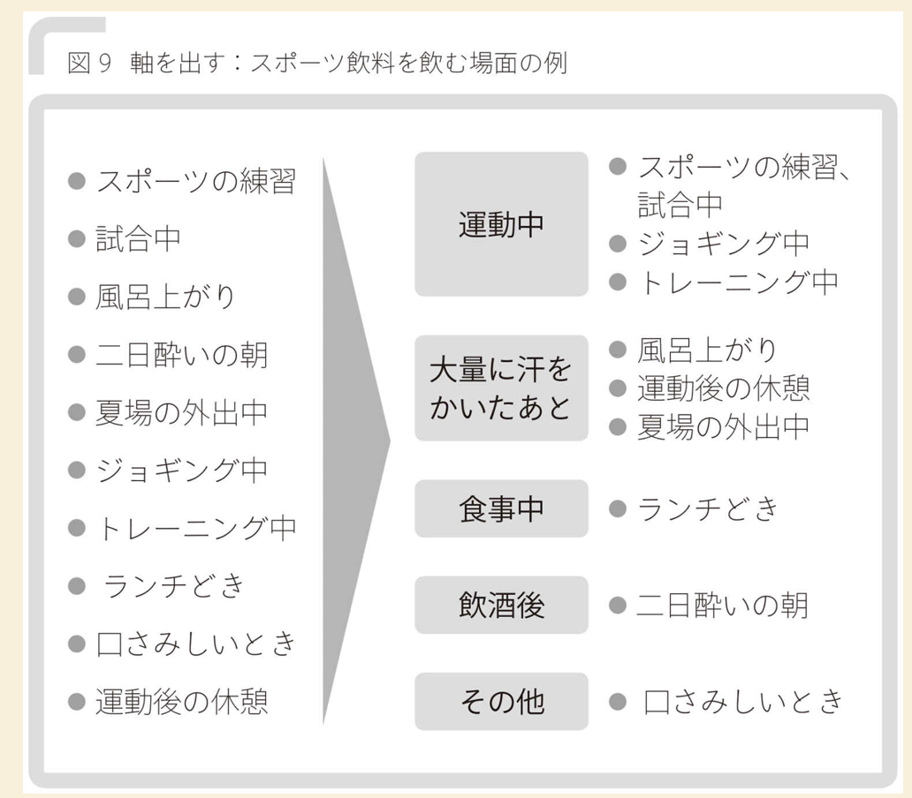

# Issueより始めよ
Issueより始めよ。

<!-- TOC -->

- [Issueより始めよ](#issueより始めよ)
- [要約](#要約)
- [1 : はじめに](#1--はじめに)
- [2 : valueのある仕事とは](#2--valueのある仕事とは)
- [3 : Issueドリブン](#3--issueドリブン)
        - [スタンスをとる](#スタンスをとる)
    - [何はともあれ言葉にする](#何はともあれ言葉にする)
    - [Issueは動くもの](#issueは動くもの)
    - [良いIssueとは](#良いissueとは)
    - [良いIsuue特定のために](#良いisuue特定のために)
- [4: Issue分析](#4-issue分析)
    - [Issueの分解](#issueの分解)
    - [ストーリーラインを組み立てる](#ストーリーラインを組み立てる)
    - [絵コンテ作り](#絵コンテ作り)
        - [定量分析の型](#定量分析の型)
        - [分析の軸の出し方](#分析の軸の出し方)

<!-- /TOC -->

# 要約

# 1 : はじめに
[リスク / ISSUE / TODO / 問題 / 課題 / 施策と言う言葉合わせ](https://note.mu/memo_notes/n/n6521797284ba)
人や企業によって、
Issueは問題にも、課題にもなり得る
、などの意味合いが変わってくるので定義する。

- 現状(As is)と理想(To Be)：
- 問題(ギャップ)：現実と理想のギャップ。問題解決＝ギャップを埋める方法を見つけ、実行すること。理想無くして問題はない。理想と問題は1対1。(「痩せられない」「東北の復興が進まない」「商品Aの売り上げが減少している」という問題は、必ず「痩せたい」「もっと東北を暮らしやすい街にしたい」「会社のより成長させたい」と言った理想があるから生まれる。)
- Issue：解決する必要性の高い問題
- Issue度：自分の置かれた局面で、Issueに対して答えを出す必要性の高さ
- 仮説：Issueに対する答え。「Aは、Bなのではないか？」「採用数減少の問題の原因は、弊社のプランドエクイティティの低下になるのではないか？」「全体の」

# 2 : valueのある仕事とは
- 「問題を解く」のではなく、「解くべき問題を見極める」(Issue度を上げる)
- 知りすぎない。
- 「数字の桁数にこだわる」より「答えが出せるかにこだわる」

正しい戦略で正しい努力をすることが大切。
そのためにも、まずはIssue(戦略・解くべき問題)を見極める。

# 3 : Issueドリブン
### スタンスをとる
Issueに対して、多少強引にでも仮説(仮の答え)を出すスタンスがまず大事。

## 何はともあれ言葉にする
Issueと仮説が見えたら、音葉にして表現して明確なものにすることが大切。
- 主語と動詞を入れる
- WHO・WHAT・HOWが答えになる。
- 比較表現を入れる。

## Issueは動くもの
答えを出すべき問題は、会社ごとに・部署ごとに・日ごとに・ミーティングごとに違う。
(長期的かつ企業の視点から見たIssueが一番大事で、それを見極めるかつ日々のIssueがそれにつながっていることは何よりも重要。)

## 良いIssueとは
- 解決におけるインパクトの大きい課題である。
- 解決の実現可能性がある。
- 深い仮説がある。
  - 深い仮説がないということは、インパクトの大きさや実現可能性を担保しきれていない。曖昧なものであってもいけない。

## 良いIsuue特定のために
情報の収集：調べすぎは良くないものの、とっかかりがなければいいイシューは出せない。
- 考えるための材料
  - 一次情報
  - 基本情報のスキャン
    - 基本情報とは
      - 業界内部の競争関係
      - 新規参入者
      - 代替品
      - 事業の下流
      - 事業の上流
      - 技術・イノベーション
      - 法則・規制
    - 見るべきポイント
      - 数字
      - 歴史的な背景を踏まえた一般常識・概念・問題感・これまでの検討の有無・内容とその結果。
      - 概要・レビュー記事・アニュアルんレポートなどによる枠組み。
  - 知りすぎない
    - 知りすぎると、その枠に頭が固まる。外部の人だからこそできる、

- より良いIssyueと出すための方法論
  - 変数を削る
  - 視覚化する
  - 最終系・あるべき姿からたどる
  - So Whatを繰り返す
  - 極端な事例を考える

# 4: Issue分析

Issueの質を担保した後に、解の質を高めるために必要な作業。
Issueの構造を明らかにしてSubIssueを洗い出し、そして様々なIssueを洗い出す作業。
  - Issueの分解
  - ストーリーライン作成
  - 絵コンテ作り
上記二つは、どんどんと変化していく。

## Issueの分解
Issueの分解は以下の要素を満たす必要がある。
- MECEに分解する。

分解する際のやり方は二つ。
- 型(フレームワーク等)に当てはめて分解する。 (トップダウン)
- 最終的に欲しいものの必要十分条件から考える。(ボトムダウン)

## ストーリーラインを組み立てる

## 絵コンテ作り

分析 = 比較である。
比較が言葉に信頼を与え、比較が論理を成り立たせ、比較がissueに答えを出す。
比較では以下を明確にする。
- 何と何を比較するのか
- 比較における軸は何を示すのか

### 定量分析の型
- 比較
- 構成
    軸の例：
- 変化
  軸の例：時間・地域等

### 分析の軸の出し方
トップダウンに構成を考えるか、ボトムアップ的に考えるか。もちろん両方やっていい。(フェルミっぽい)

- 原因と結果から軸(構成)を考える。(ドップダウン))
  > 例題：「腹の底から笑う人はそうでない人に比べて健康だ」
  原因：笑いの質と量
  結果：健康の定義と要素分解
- ブレインストーミング的に軸(まとまり)を考える。(ボトムアップ)
> スポーツ飲料を飲む場面
> 